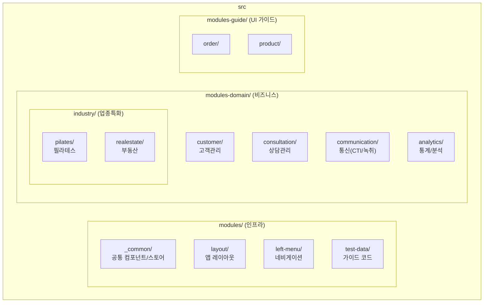
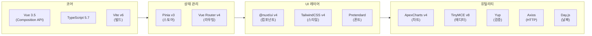
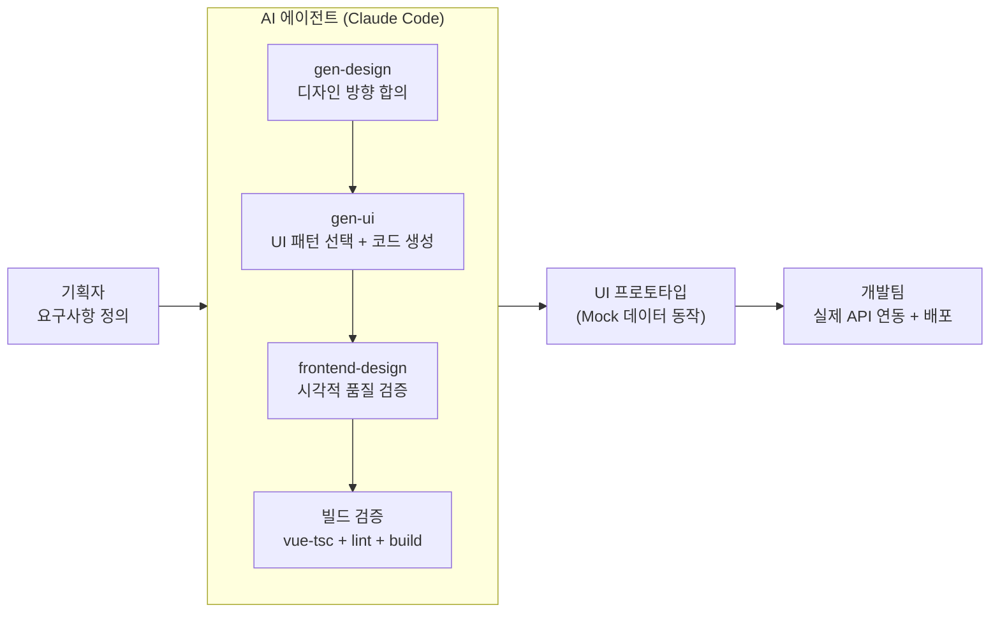

# 피치CRM UI 프로토타입

CRM Type 2 SaaS 플랫폼의 바이브코딩 기반 UI 프로토타입 — Vue 3 + Nuxt UI v4 + TailwindCSS v4.

## 빠른 시작

```bash
npm install
npm run local    # localhost 모드 (권장)
npm run dev      # 기본 개발 서버
npm run build    # production 빌드
```

## 구조



## 기술 스택



## 개발 흐름



## AI 가이드

에이전트 코딩 규칙, 컴포넌트 목록, 모듈별 UI 패턴, 디자인 시스템 전체 → [AGENTS.md](./AGENTS.md)
