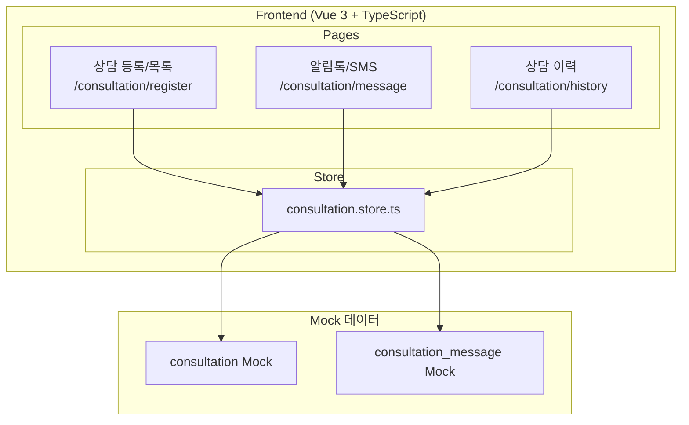
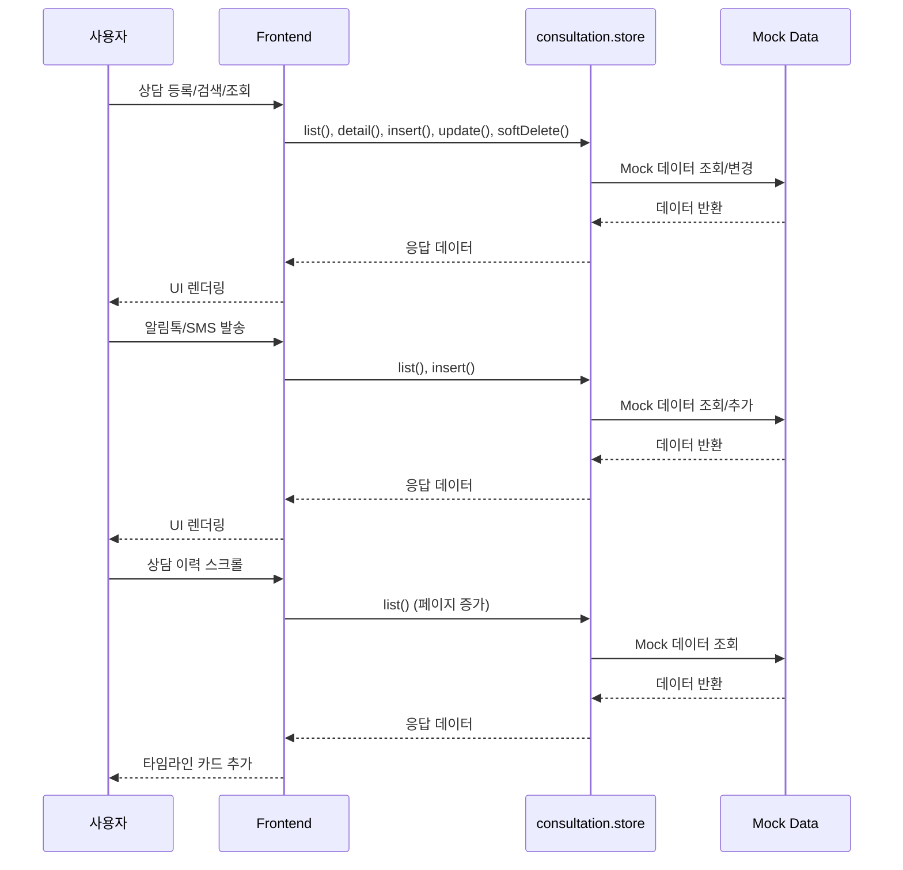
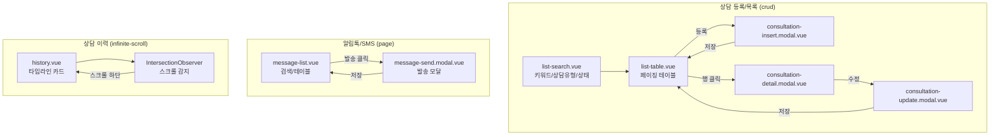
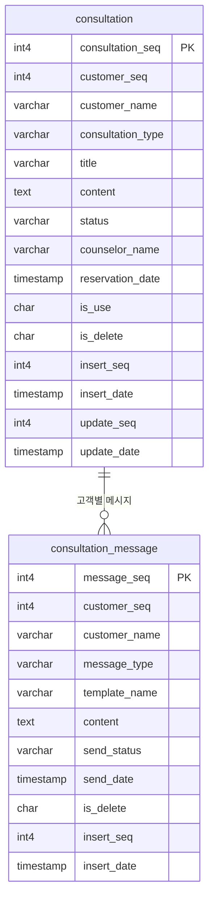

# 상담관리

> CRM 상담 등록/관리, 알림톡/SMS 발송, 상담 이력 조회

---

# Part A: Visual Overview (사람용)

이 섹션은 시각적 이해를 위한 다이어그램입니다. Mermaid 코드도 텍스트로 읽어 구조 파악에 활용됩니다.

---

## 1. 시스템 아키텍처



---

## 2. 데이터 흐름



---

## 3. UI 흐름도



---

## 4. ER 다이어그램



---

# Part B: Detailed Spec (AI용)

이 섹션은 AI 코드 생성을 위한 상세 명세입니다.

---

## 메타
- 모듈명: consultation
- 테이블명: consultation, consultation_message
- 한글 기능명: 상담관리
- 한줄 설명: CRM 상담 등록/관리, 알림톡/SMS 발송, 상담 이력 조회
- UI 패턴: crud (상담등록) + page (알림톡) + infinite-scroll (이력)
- 파일 업로드: N
- 프로젝트: crm-ui-proto (프론트엔드 프로토타입, Backend 없음, Mock 데이터 사용)
- DB 종류: PostgreSQL (PK: serial4, INT: int4, FK: int4, DATETIME: TIMESTAMP)
- FK 제약조건: 생성하지 않음

---

## 1. 기능 범위 (CRUD)

### consultation (상담)
| 기능 | 적용 | 설명 |
|------|------|------|
| 페이징 목록 | Y | 키워드/상담유형/상태 검색 + 페이지네이션 |
| 키워드 검색 | Y | customerName, title, content 검색 |
| 상세 조회 | Y | 모달로 상세 표시 |
| 등록 | Y | 모달로 등록 |
| 수정 | Y | 모달로 수정 |
| 사용여부 변경 | N | - |
| 논리 삭제 | Y | isDelete='Y' 처리 |

### consultation_message (알림톡/SMS)
- 목록 조회, 등록 (발송) 기능
- 페이징 목록, 키워드 검색 지원

---

## 2. 타입 정보 (구현 기준)

### Consultation
| 필드 | 타입 | 설명 | 선택값 |
|------|------|------|--------|
| consultationSeq | number | PK | - |
| customerSeq | number | 고객 PK | - |
| customerName | string | 고객명 | - |
| consultationType | string | 상담유형 | 전화/방문/온라인 |
| title | string | 제목 | - |
| content | string | 내용 | - |
| status | string | 상태 | 대기/진행/완료/취소 |
| counselorName | string | 상담사명 | - |
| reservationDate | string | 예약일시 | - |
| isUse | string | 사용여부 | - |
| isDelete | string | 삭제여부 | - |
| insertSeq | number | 등록자 | - |
| insertDate | string | 등록일 | - |
| updateSeq | number | 수정자 | - |
| updateDate | string | 수정일 | - |

### ConsultationMessage
| 필드 | 타입 | 설명 | 선택값 |
|------|------|------|--------|
| messageSeq | number | PK | - |
| customerSeq | number | 고객 PK | - |
| customerName | string | 고객명 | - |
| messageType | string | 메시지유형 | 알림톡/SMS/이메일 |
| templateName | string | 템플릿명 | - |
| content | string | 내용 | - |
| sendStatus | string | 발송상태 | 대기/발송/실패/취소 |
| sendDate | string | 발송일시 | - |
| isDelete | string | 삭제여부 | - |
| insertSeq | number | 등록자 | - |
| insertDate | string | 등록일 | - |

---

## 3. UI 구성

### 3.1 상담 등록/목록 (`/consultation/register`)
- **패턴**: crud
- **구성**: list.vue + list-search.vue + list-table.vue + insert/update/detail 모달
- **검색**: 키워드, 상담유형(consultationType), 상태(status)
- **테이블 컬럼**: consultationSeq, customerName, consultationType, title, status(배지), counselorName, reservationDate
- **모달**: consultation-insert.modal.vue, consultation-update.modal.vue, consultation-detail.modal.vue

### 3.2 알림톡/SMS (`/consultation/message`)
- **패턴**: page
- **구성**: message-list.vue + message-send.modal.vue
- **검색**: 키워드, messageType
- **테이블 컬럼**: messageSeq, customerName, messageType, templateName, sendStatus(배지), sendDate

### 3.3 상담 이력 (`/consultation/history`)
- **패턴**: infinite-scroll
- **구성**: history.vue
- **동작**: IntersectionObserver로 스크롤 감지 → 추가 데이터 로드
- **표시**: 타임라인형 카드 목록

---

## 4. Frontend 파일 목록

```
src/modules-domain/consultation/
├── type/consultation.type.ts
├── store/consultation.store.ts
├── pages/
│   ├── _consultation.routes.ts
│   ├── list.vue
│   ├── list-search.vue
│   ├── list-table.vue
│   ├── consultation-insert.modal.vue
│   ├── consultation-update.modal.vue
│   ├── consultation-detail.modal.vue
│   ├── message-list.vue
│   ├── message-send.modal.vue
│   └── history.vue
```

---

## 5. 참조
- 가이드 코드: `src/modules/test-data/`
- UI 생성 스킬: `.claude/skills/gen-ui/SKILL.md`
- AGENTS.md: 상담관리 모듈 UI 가이드
