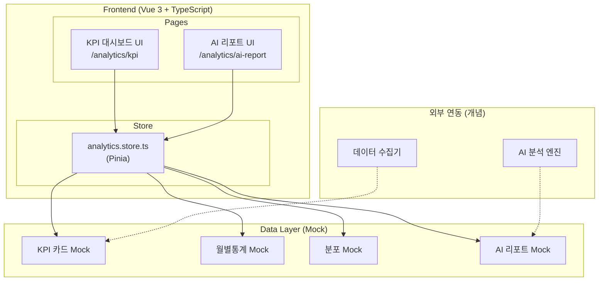
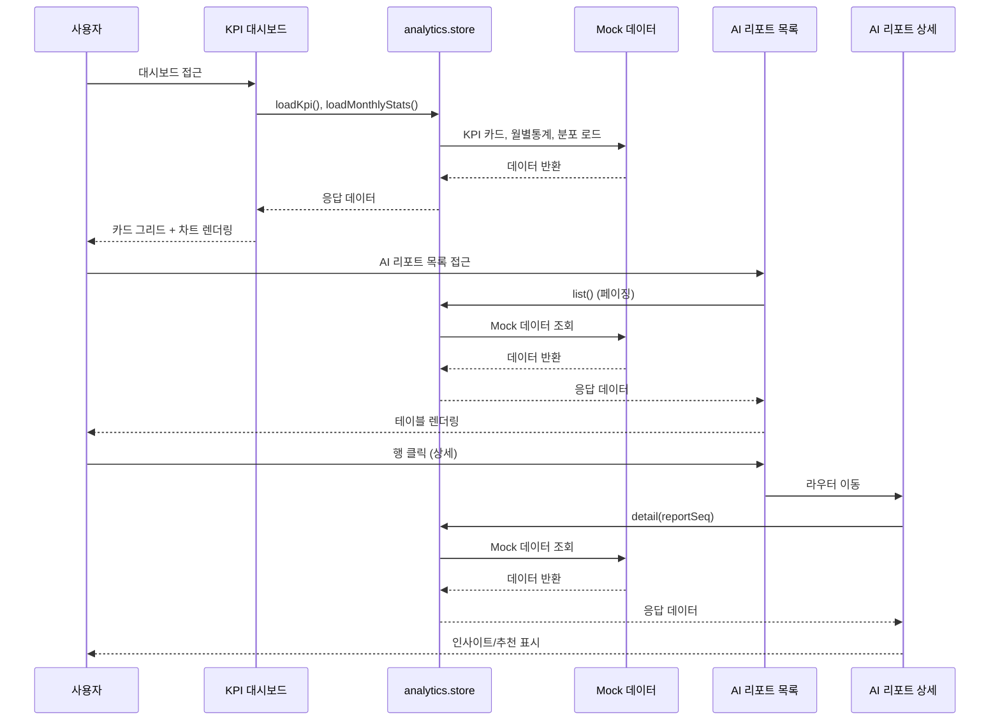
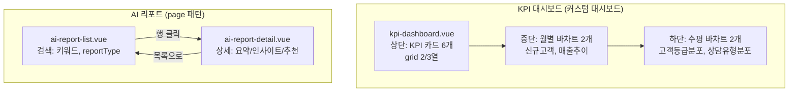
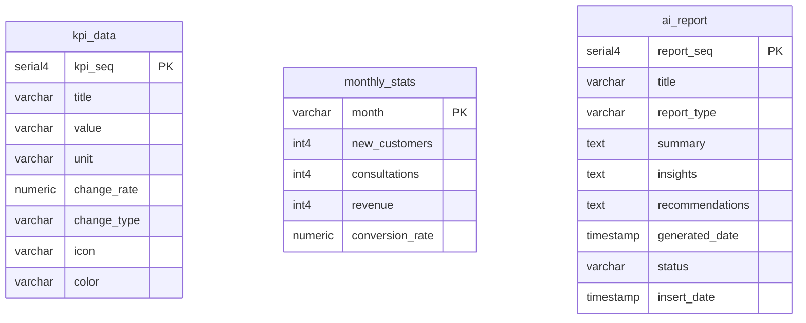

# 통계분석

> KPI 모니터링 대시보드 및 AI 기반 분석 리포트

---

# Part A: Visual Overview (사람용)

이 섹션은 시각적 이해를 위한 다이어그램입니다. Mermaid 코드도 텍스트로 읽어 구조 파악에 활용됩니다.

---

## 1. 시스템 아키텍처



---

## 2. 데이터 흐름



---

## 3. UI 흐름도



---

## 4. ER 다이어그램



---

# Part B: Detailed Spec (AI용)

이 섹션은 AI 코드 생성을 위한 상세 명세입니다.

---

## 메타
- 모듈명: analytics
- 테이블명: kpi_data, monthly_stats, ai_report
- 한글 기능명: 통계분석
- 한줄 설명: KPI 모니터링 대시보드 및 AI 기반 분석 리포트
- UI 패턴: 커스텀 대시보드 (KPI) + page (AI 리포트)
- 파일 업로드: N
- 프로젝트: crm-ui-proto (프론트엔드 프로토타입, Backend 없음, Mock 데이터 사용)
- DB 종류: PostgreSQL (PK: serial4, INT: int4, FK: int4, DATETIME: TIMESTAMP)
- FK 제약조건: 생성하지 않음

---

## 1. 기능 범위 (CRUD)

### KPI
| 기능 | 적용 | 설명 |
|------|------|------|
| 조회 | Y | loadKpi(), loadMonthlyStats() - Mock 데이터 로드 |
| 페이징 목록 | N | - |
| 상세 조회 | N | - |
| 등록/수정/삭제 | N | - |

### AI 리포트
| 기능 | 적용 | 설명 |
|------|------|------|
| 페이징 목록 | Y | 키워드, reportType 필터 |
| 상세 조회 | Y | reportSeq 기준 상세 페이지 |
| 생성 요청 | Y | 토스트 알림만 (실제 생성 없음) |
| 수정/삭제 | N | - |

---

## 2. 타입 정보 (구현 기준)

### KpiCard
| 필드 | 타입 | 설명 | 선택값 |
|------|------|------|--------|
| kpiSeq | number | KPI 순번 | - |
| title | string | 제목 | - |
| value | string | 표시값 | - |
| unit | string | 단위 | - |
| changeRate | number | 변화율(%) | - |
| changeType | string | 변화 방향 | up/down/flat |
| icon | string | 아이콘 | - |
| color | string | 카드 색상 | primary/success/warning/error |

### KpiChartData
| 필드 | 타입 | 설명 |
|------|------|------|
| label | string | 라벨 |
| value | number | 값 |
| color | string | 색상 |

### MonthlyStats
| 필드 | 타입 | 설명 |
|------|------|------|
| month | string | 월 (YYYY-MM) |
| newCustomers | number | 신규 고객 수 |
| consultations | number | 상담 수 |
| revenue | number | 매출 (원) |
| conversionRate | number | 전환율 (%) |

### AiReport
| 필드 | 타입 | 설명 | 선택값 |
|------|------|------|--------|
| reportSeq | number | 리포트 순번 | - |
| title | string | 제목 | - |
| reportType | string | 리포트 유형 | 월간분석/고객분석/매출분석/트렌드 |
| summary | string | 요약 | - |
| insights | string[] | 주요 인사이트 | - |
| recommendations | string[] | 추천 사항 | - |
| generatedDate | string | 생성일시 | - |
| status | string | 상태 | 생성중/완료/실패 |
| insertDate | string | 등록일 | - |

---

## 3. UI 구성

### 3.1 KPI 모니터링 (`/analytics/kpi`)
- **패턴**: 커스텀 대시보드
- **구성**: kpi-dashboard.vue (단일 페이지)
- **상단**: KPI 카드 6개 (grid 2/3열)
  - 신규고객: 128, +12.5%
  - 상담전환율: 87%, +5.2%
  - 월매출: 2,450만, +8.3%
  - 활성멤버십: 342, -2.1%
  - 평균상담시간: 15분, -10.5%
  - 고객만족도: 4.5/5, +0.3
- **중단**: 월별 바차트 2개 (신규고객, 매출추이) - CSS div로 구현
- **하단**: 수평 바차트 2개 (고객등급분포, 상담유형분포) - CSS div로 구현
- **외부 차트 라이브러리**: 사용하지 않음

### 3.2 AI 리포트 목록 (`/analytics/ai-report`)
- **패턴**: page
- **구성**: ai-report-list.vue
- **검색**: 키워드, reportType 필터
- **테이블(u-table)**: reportSeq, title, reportType(배지), summary(말줄임), status(배지), generatedDate
- **reportType 배지색**: 월간분석:primary, 고객분석:success, 매출분석:warning, 트렌드:info
- **"AI 리포트 생성" 버튼**: 클릭 시 토스트 알림만 표시

### 3.3 AI 리포트 상세 (`/analytics/ai-report/:reportSeq`)
- **패턴**: page
- **구성**: ai-report-detail.vue
- **상단**: 제목 + 유형 배지 + 상태 + 생성일
- **AI 요약 섹션**: 큰 폰트, 회색 배경
- **주요 인사이트**: 번호 리스트 + 체크 아이콘
- **추천 사항**: 리스트 + 화살표 아이콘
- **"목록으로" 버튼**: 라우터로 목록 이동

---

## 4. DB 스키마 (PostgreSQL, 개념적)

### kpi_data
| 컬럼 | 타입 | 필수 | 설명 |
|------|------|------|------|
| kpi_seq | serial4 | Y | PK |
| title | VARCHAR(100) | Y | KPI 제목 |
| value | VARCHAR(50) | Y | 표시값 |
| unit | VARCHAR(20) | Y | 단위 |
| change_rate | NUMERIC(5,2) | Y | 변화율(%) |
| change_type | VARCHAR(10) | Y | up/down/flat |
| icon | VARCHAR(50) | Y | 아이콘 |
| color | VARCHAR(20) | Y | primary/success/warning/error |

### monthly_stats
| 컬럼 | 타입 | 필수 | 설명 |
|------|------|------|------|
| month | VARCHAR(7) | Y | 월 (YYYY-MM) |
| new_customers | int4 | Y | 신규 고객 수 |
| consultations | int4 | Y | 상담 수 |
| revenue | int4 | Y | 매출 (원) |
| conversion_rate | NUMERIC(5,2) | Y | 전환율 (%) |

### ai_report
| 컬럼 | 타입 | 필수 | 설명 |
|------|------|------|------|
| report_seq | serial4 | Y | PK |
| title | VARCHAR(200) | Y | 제목 |
| report_type | VARCHAR(20) | Y | 월간분석/고객분석/매출분석/트렌드 |
| summary | TEXT | Y | 요약 |
| insights | TEXT | Y | JSON 배열 (인사이트) |
| recommendations | TEXT | Y | JSON 배열 (추천사항) |
| generated_date | TIMESTAMP | Y | 생성일시 |
| status | VARCHAR(10) | Y | 생성중/완료/실패 |
| insert_date | TIMESTAMP | Y | 등록일 |

---

## 5. Frontend 파일 목록

```
src/modules-domain/analytics/
├── type/analytics.type.ts
├── store/analytics.store.ts
├── pages/
│   ├── _analytics.routes.ts
│   ├── kpi-dashboard.vue
│   ├── ai-report-list.vue
│   └── ai-report-detail.vue
```

---

## 6. 참조
- 가이드 코드: `src/modules/test-data/`
- 구현된 코드: `src/modules-domain/analytics/`
- UI 생성 스킬: `.claude/skills/gen-ui/SKILL.md`
- AGENTS.md: 통계/분석 모듈 UI 가이드
