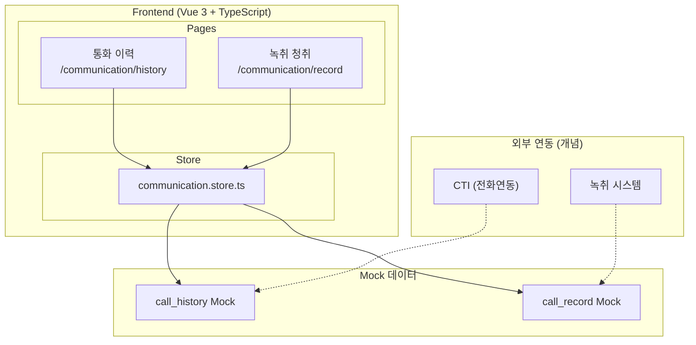
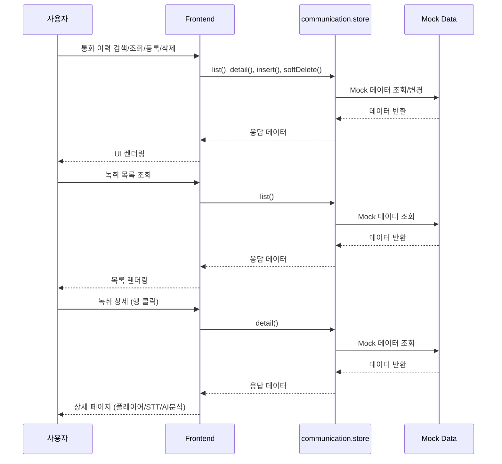
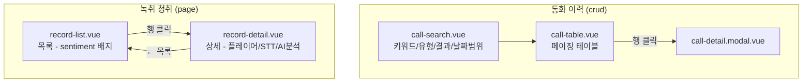
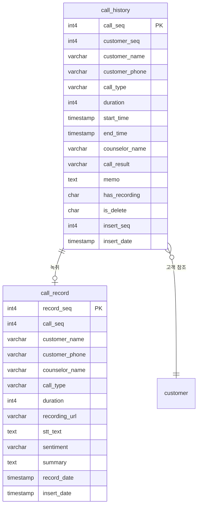

# 통신

> 통화 이력 관리, 녹취 청취 및 AI 분석 (STT, 감정분석, 요약)

---

# Part A: Visual Overview (사람용)

이 섹션은 시각적 이해를 위한 다이어그램입니다. Mermaid 코드도 텍스트로 읽어 구조 파악에 활용됩니다.

---

## 1. 시스템 아키텍처



---

## 2. 데이터 흐름



---

## 3. UI 흐름도



---

## 4. ER 다이어그램



---

# Part B: Detailed Spec (AI용)

이 섹션은 AI 코드 생성을 위한 상세 명세입니다.

---

## 메타
- 모듈명: communication
- 테이블명: call_history, call_record
- 한글 기능명: 통신
- 한줄 설명: 통화 이력 관리, 녹취 청취 및 AI 분석 (STT, 감정분석, 요약)
- UI 패턴: crud (통화이력) + page (녹취)
- 파일 업로드: N
- 프로젝트: crm-ui-proto (프론트엔드 프로토타입, Backend 없음, Mock 데이터 사용)
- DB 종류: PostgreSQL (PK: serial4, INT: int4, FK: int4, DATETIME: TIMESTAMP)
- FK 제약조건: 생성하지 않음

---

## 1. 기능 범위 (CRUD)

### call_history (통화이력)
| 기능 | 적용 | 설명 |
|------|------|------|
| 페이징 목록 | Y | 키워드/유형/결과/날짜범위 검색 + 페이지네이션 |
| 키워드 검색 | Y | customerName, customerPhone 검색 |
| 상세 조회 | Y | 모달로 상세 표시 |
| 등록 | Y | 모달로 등록 |
| 수정 | N | - |
| 사용여부 변경 | N | - |
| 논리 삭제 | Y | isDelete='Y' 처리 |

---

## 2. 타입 정보 (구현 기준)

### CallHistory
| 필드 | 타입 | 설명 | 선택값 |
|------|------|------|--------|
| callSeq | number | PK | - |
| customerSeq | number | 고객 PK | - |
| customerName | string | 고객명 | - |
| customerPhone | string | 고객전화번호 | - |
| callType | string | 통화유형 | 인바운드/아웃바운드 |
| duration | number | 통화시간(초) | - |
| startTime | string | 통화시작 | - |
| endTime | string | 통화종료 | - |
| counselorName | string | 상담사명 | - |
| callResult | string | 통화결과 | 연결/부재/통화중/거절 |
| memo | string | 메모 | - |
| hasRecording | string | 녹취여부 | Y/N |
| isDelete | string | 삭제여부 | - |
| insertSeq | number | 등록자 | - |
| insertDate | string | 등록일 | - |

### CallRecord
| 필드 | 타입 | 설명 | 선택값 |
|------|------|------|--------|
| recordSeq | number | PK | - |
| callSeq | number | 통화 PK | - |
| customerName | string | 고객명 | - |
| customerPhone | string | 고객전화번호 | - |
| counselorName | string | 상담사명 | - |
| callType | string | 통화유형 | 인바운드/아웃바운드 |
| duration | number | 통화시간(초) | - |
| recordingUrl | string | 녹취URL | - |
| sttText | string | STT 텍스트 | - |
| sentiment | string | 감정분석 | 긍정/부정/중립 |
| summary | string | AI 요약 | - |
| recordDate | string | 녹취일 | - |
| insertDate | string | 등록일 | - |

---

## 3. UI 구성

### 3.1 통화 이력 (`/communication/history`)
- **패턴**: crud
- **구성**: call-list.vue + call-search.vue + call-table.vue + detail 모달
- **검색**: 키워드(고객명/전화번호), callType, callResult, 날짜범위
- **duration**: mm:ss 포맷 표시
- **callResult 배지**: 연결:success, 부재:warning, 통화중:info, 거절:error
- **hasRecording Y**: 녹음 아이콘 표시
- **모달**: call-detail.modal.vue

### 3.2 녹취 청취 목록 (`/communication/record`)
- **패턴**: page
- **구성**: record-list.vue
- **sentiment 배지**: 긍정:success, 부정:error, 중립:neutral
- **행 클릭**: 상세 페이지 이동

### 3.3 녹취 상세 (`/communication/record/:recordSeq`)
- **패턴**: page
- **구성**: record-detail.vue
- **상단**: 고객/통화 정보 카드
- **중간**: 음성 플레이어 UI (Mock)
- **하단 좌**: STT 텍스트 (채팅 UI)
- **하단 우**: AI 분석 (감정+요약)

---

## 4. Frontend 파일 목록

```
src/modules-domain/communication/
├── type/communication.type.ts
├── store/communication.store.ts
├── pages/
│   ├── _communication.routes.ts
│   ├── call-list.vue
│   ├── call-search.vue
│   ├── call-table.vue
│   ├── call-detail.modal.vue
│   ├── record-list.vue
│   └── record-detail.vue
```

---

## 5. 참조
- 가이드 코드: `src/modules/test-data/`
- UI 생성 스킬: `.claude/skills/gen-ui/SKILL.md`
- AGENTS.md: 통신 모듈 UI 가이드
