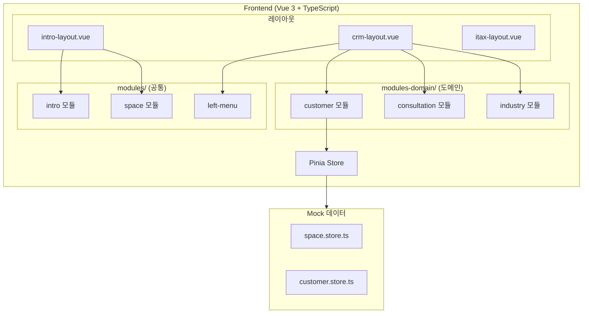
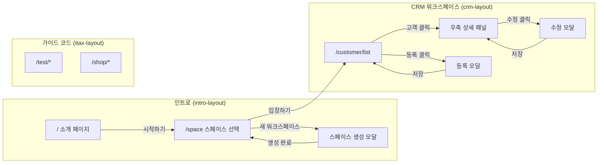
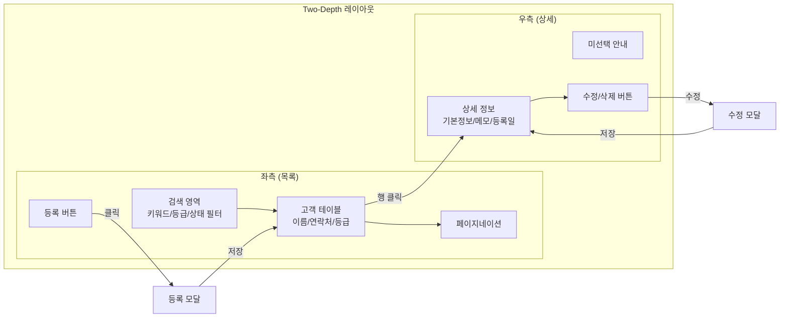
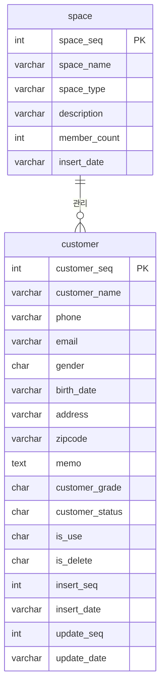

# CRM Type 2 프로토타입

> 업종별 특화 CRM SaaS 플랫폼의 UI 프로토타입. 소개 페이지, 스페이스 선택/생성, 고객관리(Two-Depth) 화면 포함

---

# Part A: Visual Overview (사람용)

이 섹션은 시각적 이해를 위한 다이어그램입니다. Mermaid 코드도 텍스트로 읽어 구조 파악에 활용됩니다.

---

## 시스템 아키텍처



---

## 전체 UI 흐름



---

## 고객관리 UI 흐름도 (Two-Depth)



---

## ER 다이어그램



---

# Part B: Detailed Spec (AI용)

이 섹션은 AI 코드 생성을 위한 상세 명세입니다.

---

## 메타
- 프로젝트: crm-ui-proto
- 한글 기능명: CRM 타입2 프로토타입
- 한줄 설명: 업종별 특화 CRM SaaS 플랫폼의 프론트엔드 UI 프로토타입
- 기술 스택: Vue 3 + TypeScript + Nuxt UI v3 + TailwindCSS v4
- 데이터: Mock 데이터 (Backend API 없음)

---

## 1. 모듈 구성

### 레이아웃 모듈 (src/modules/layout/)
| 파일 | 용도 |
|------|------|
| intro-layout.vue | 소개/스페이스 페이지용 레이아웃 (상단 헤더 + 푸터) |
| crm-layout.vue | CRM 워크스페이스 레이아웃 (좌측 메뉴 + 상단 헤더) |
| itax-layout.vue | 기존 가이드 코드용 레이아웃 (수정 없음) |
| components/layout-intro-top.vue | 인트로 헤더 (브랜드 + 메뉴 + 시작하기) |

### 인트로 모듈 (src/modules/intro/)
| 파일 | 용도 |
|------|------|
| pages/intro.vue | 인트로 메인 페이지 (4개 섹션) |
| components/intro-hero-section.vue | 히어로 섹션 (CTA + 통계) |
| components/intro-features-section.vue | 핵심 기능 소개 (3개 카드) |
| components/intro-how-it-works-section.vue | 사용법 (3단계) |
| components/intro-contact-section.vue | 상담 문의 폼 |
| pages/_intro.routes.ts | 인트로 라우트 |

### 스페이스 모듈 (src/modules/space/)
| 파일 | 용도 |
|------|------|
| type/space.type.ts | 스페이스 타입 (Space, SpaceInsertDto, SpaceType) |
| store/space.store.ts | 스페이스 스토어 (Mock CRUD + 현재 스페이스 관리) |
| pages/space-select.vue | 스페이스 선택 전체 페이지 |
| pages/space-create.modal.vue | 스페이스 생성 모달 (이름, 유형, 설명) |
| pages/_space.routes.ts | 스페이스 라우트 |

### 고객관리 모듈 (src/modules-domain/customer/)
| 파일 | 용도 |
|------|------|
| type/customer.type.ts | 고객 타입 (Customer, PagingDto, InsertDto, UpdateDto, SearchDto) |
| store/customer.store.ts | 고객 스토어 (Mock CRUD + 페이징 + 검색) |
| pages/list.vue | Two-Depth 메인 (좌측 목록 + 우측 상세) |
| pages/list-search.vue | 검색 영역 (키워드, 등급, 상태 필터) |
| pages/list-table.vue | 테이블 영역 (페이징 + 정렬 + 행 선택) |
| pages/detail-panel.vue | 상세 패널 (고객 정보 + 수정/삭제 버튼) |
| pages/customer-insert.modal.vue | 고객 등록 모달 |
| pages/customer-update.modal.vue | 고객 수정 모달 |
| pages/_customer.routes.ts | 고객 라우트 |

---

## 2. 라우팅 구조

### 라우트 맵

| 경로 | 레이아웃 | 모듈 | 설명 |
|------|----------|------|------|
| / | intro-layout | intro | 소개 페이지 |
| /space | intro-layout | space | 스페이스 선택/생성 |
| /customer/list | crm-layout | customer | 고객 목록 (Two-Depth) |
| /consultation/* | crm-layout | consultation | 상담관리 (placeholder) |
| /industry/* | crm-layout | industry | 업종 특화 (placeholder) |
| /communication/* | crm-layout | communication | 통신 (placeholder) |
| /analytics/* | crm-layout | analytics | 통계/분석 (placeholder) |
| /test/* | itax-layout | test-data | 가이드 코드 |
| /shop/* | itax-layout | shop | 쇼핑몰 |

### 레이아웃 분기

```
라우트 접근
  │
  ├── / , /space → intro-layout (소개 헤더 + 푸터)
  │
  ├── /customer/*, /consultation/*, /industry/*
  │   /communication/*, /analytics/* → crm-layout (좌측 메뉴 + CRM 헤더)
  │
  └── /test/*, /shop/*, /ngo-banner/* → itax-layout (기존 유지)
```

---

## 3. 스페이스 타입 (spaceType)

CRM Type 2의 핵심 개념. 업종별 특화 기능 제공의 기준

| spaceType | 라벨 | 배지 색상 | 특화 기능 |
|-----------|------|----------|----------|
| basic | 기본 CRM | primary (파란) | 고객관리, 상담 |
| pilates | 필라테스 | success (초록) | 수업관리, 멤버십, 출석체크 |
| realestate | 부동산 | warning (노랑) | 매물관리, 매칭시스템 |

---

## 4. 고객관리 상세 스펙

### UI 패턴: Two-Depth

### CRUD 기능
| 기능 | 적용 | 설명 |
|------|------|------|
| 페이징 목록 | Y | 키워드/등급/상태 검색 + 페이지네이션 |
| 상세 조회 | Y | 행 클릭 시 우측 패널 표시 |
| 등록 | Y | 모달 팝업으로 등록 |
| 수정 | Y | 모달 팝업으로 수정 |
| 사용여부 변경 | Y | isUse 토글 |
| 논리 삭제 | Y | isDelete='Y' 처리 |

### 고객 필드
| 필드 | 타입 | 필수 | 설명 | 선택값 |
|------|------|------|------|--------|
| customerSeq | number | Y | PK | 자동증가 |
| customerName | string | Y | 고객 이름 | - |
| phone | string | Y | 전화번호 | - |
| email | string | N | 이메일 | - |
| gender | string | Y | 성별 | M:남성, F:여성 |
| birthDate | string | N | 생년월일 | - |
| address | string | N | 주소 | - |
| zipcode | string | N | 우편번호 | - |
| memo | string | N | 메모 | - |
| customerGrade | string | Y | 고객 등급 | A:VIP, B:우수, C:일반, D:관심 |
| customerStatus | string | Y | 고객 상태 | A:활성, I:비활성, D:탈퇴 |
| isUse | string | Y | 사용여부 | Y:사용, N:미사용 |
| isDelete | string | Y | 삭제여부 | Y:삭제, N:정상 |
| insertSeq | number | Y | 등록자 | - |
| insertDate | string | Y | 등록일 | - |
| updateSeq | number | Y | 수정자 | - |
| updateDate | string | Y | 수정일 | - |

### 검증 규칙
| 필드 | 규칙 |
|------|------|
| customerName | 필수, 50자 이내 |
| phone | 필수, 전화번호 형식 |
| email | 이메일 형식 |
| customerGrade | 필수, A/B/C/D 중 택 1 |

---

## 5. 디자인 시스템

### 색상
| 용도 | 값 |
|------|-----|
| Primary | #287dff |
| Hero CTA | #287dff (solid) |
| Hero Gradient Text | linear-gradient(135deg, #287dff, #1a6ae6, #1259cc) |
| Section Background (Steps) | linear-gradient(180deg, #eff6ff, #dbeafe, #e0f2fe) |

### 타이포그래피
- 기본 폰트: Pretendard
- 히어로 타이틀: 5xl~7xl, font-light/font-semibold

### 간격 & 레이아웃
- 4px 배수 간격 사용
- 그림자: shadow-sm (최대)
- 둥근 모서리: rounded-md ~ rounded-2xl

### AI Slop 방지
- bg-gradient-to-* 사용 제한 (인트로 배경은 예외)
- shadow-xl, shadow-2xl 미사용
- animate-pulse, animate-bounce 미사용
- hover:scale-* 미사용

---

## 6. 파일 목록

### Frontend (전체)
```
src/
├── modules/
│   ├── layout/
│   │   ├── intro-layout.vue           (신규)
│   │   ├── crm-layout.vue             (신규)
│   │   ├── itax-layout.vue            (기존 유지)
│   │   └── components/
│   │       └── layout-intro-top.vue   (신규)
│   ├── intro/
│   │   ├── pages/
│   │   │   ├── intro.vue
│   │   │   └── _intro.routes.ts
│   │   └── components/
│   │       ├── intro-hero-section.vue
│   │       ├── intro-features-section.vue
│   │       ├── intro-how-it-works-section.vue
│   │       └── intro-contact-section.vue
│   ├── space/
│   │   ├── type/space.type.ts
│   │   ├── store/space.store.ts
│   │   └── pages/
│   │       ├── space-select.vue
│   │       ├── space-create.modal.vue
│   │       └── _space.routes.ts
│   └── left-menu/
│       └── store/left-menu.store.ts   (수정: /customer/list URL 추가)
├── modules-domain/
│   └── customer/
│       ├── type/customer.type.ts
│       ├── store/customer.store.ts
│       └── pages/
│           ├── list.vue
│           ├── list-search.vue
│           ├── list-table.vue
│           ├── detail-panel.vue
│           ├── customer-insert.modal.vue
│           ├── customer-update.modal.vue
│           └── _customer.routes.ts
├── router.ts                          (수정: 레이아웃 분기 라우팅)
└── App.vue                            (기존 유지)
```

---

## 7. 참조
- CRM Type 2 아키텍처 PRD: `crm-ai-dev/prd/250921-CRM_타입2_아키텍처_다이어그램.md`
- marketScope 프론트: `/Users/nettem/source/marketScope/market-www/front` (인트로/스페이스 UI 원본)
- 가이드 코드: `src/modules/test-data/` (Two-Depth: `pages/two-depth/`)
- 디자인 스킬: `.claude/skills/gen-design/SKILL.md`
- UI 생성 스킬: `.claude/skills/gen-ui/SKILL.md`
