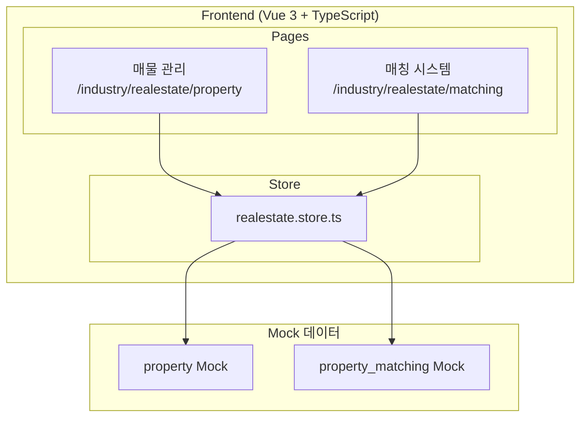
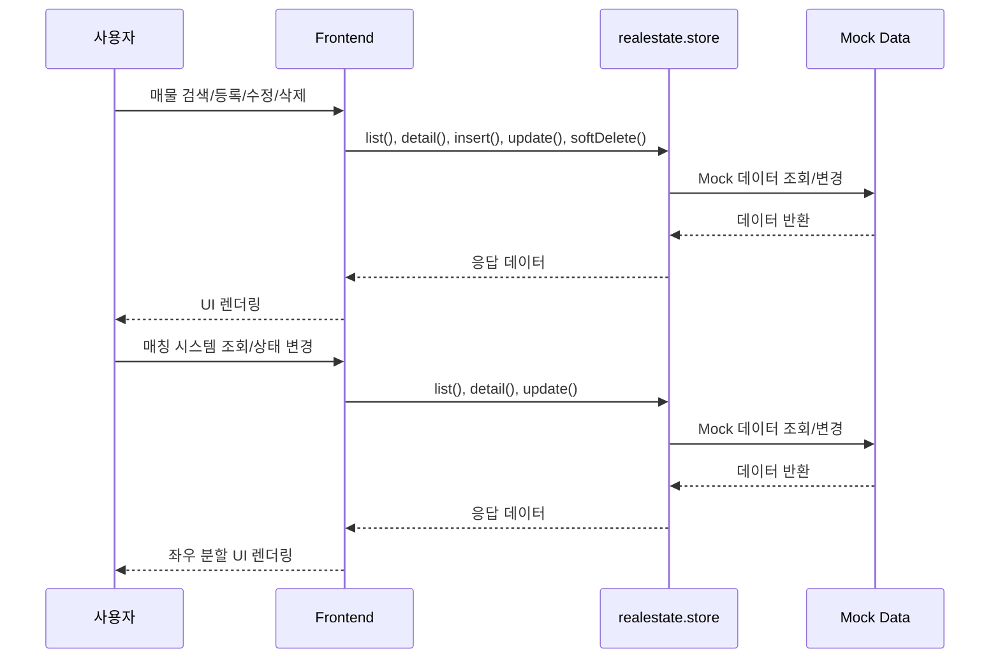
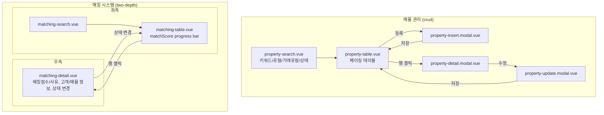
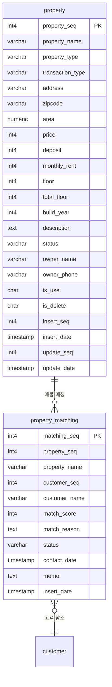

# 부동산

> 부동산 매물 관리 및 고객-매물 매칭 시스템

---

# Part A: Visual Overview (사람용)

이 섹션은 시각적 이해를 위한 다이어그램입니다. Mermaid 코드도 텍스트로 읽어 구조 파악에 활용됩니다.

---

## 1. 시스템 아키텍처



---

## 2. 데이터 흐름



---

## 3. UI 흐름도



---

## 4. ER 다이어그램



---

# Part B: Detailed Spec (AI용)

이 섹션은 AI 코드 생성을 위한 상세 명세입니다.

---

## 메타
- 모듈명: industry/realestate
- 테이블명: property, property_matching
- 한글 기능명: 부동산
- 한줄 설명: 부동산 매물 관리 및 고객-매물 매칭 시스템
- UI 패턴: crud (매물) + two-depth (매칭)
- 파일 업로드: N
- 프로젝트: crm-ui-proto (프론트엔드 프로토타입, Backend 없음, Mock 데이터 사용)
- DB 종류: PostgreSQL (PK: serial4, INT: int4, FK: int4, DATETIME: TIMESTAMP)
- FK 제약조건: 생성하지 않음

---

## 1. 기능 범위 (CRUD)

### property (매물)
| 기능 | 적용 | 설명 |
|------|------|------|
| 페이징 목록 | Y | 키워드/유형/거래유형/상태 검색 + 페이지네이션 |
| 키워드 검색 | Y | address, ownerName 검색 |
| 상세 조회 | Y | 모달로 상세 표시 |
| 등록 | Y | 모달로 등록 |
| 수정 | Y | 모달로 수정 |
| 사용여부 변경 | N | - |
| 논리 삭제 | Y | isDelete='Y' 처리 |

---

## 2. 타입 정보 (구현 기준)

### Property
| 필드 | 타입 | 설명 | 선택값 |
|------|------|------|--------|
| propertySeq | number | PK | - |
| propertyName | string | 매물명 | - |
| propertyType | string | 매물유형 | 아파트/오피스텔/빌라/상가/토지 |
| transactionType | string | 거래유형 | 매매/전세/월세 |
| address | string | 주소 | - |
| zipcode | string | 우편번호 | - |
| area | number | 면적(m²) | - |
| price | number | 가격(만원) | - |
| deposit | number | 보증금(만원) | - |
| monthlyRent | number | 월세(만원) | - |
| floor | number | 층 | - |
| totalFloor | number | 총층수 | - |
| buildYear | number | 준공년도 | - |
| description | string | 설명 | - |
| status | string | 상태 | 등록/계약중/계약완료/보류 |
| ownerName | string | 소유자명 | - |
| ownerPhone | string | 소유자연락처 | - |
| isUse | string | 사용여부 | - |
| isDelete | string | 삭제여부 | - |
| insertSeq | number | 등록자 | - |
| insertDate | string | 등록일 | - |
| updateSeq | number | 수정자 | - |
| updateDate | string | 수정일 | - |

### PropertyMatching
| 필드 | 타입 | 설명 | 선택값 |
|------|------|------|--------|
| matchingSeq | number | PK | - |
| propertySeq | number | 매물 PK | - |
| propertyName | string | 매물명 | - |
| customerSeq | number | 고객 PK | - |
| customerName | string | 고객명 | - |
| matchScore | number | 매칭점수(0-100) | - |
| matchReason | string | 매칭사유 | - |
| status | string | 상태 | 추천/상담예정/상담완료/계약 |
| contactDate | string | 연락일 | - |
| memo | string | 메모 | - |
| insertDate | string | 등록일 | - |

---

## 3. UI 구성

### 3.1 매물 관리 (`/industry/realestate/property`)
- **패턴**: crud
- **구성**: property-list.vue + property-search.vue + property-table.vue + insert/update/detail 모달
- **검색**: 키워드(주소/소유자명), propertyType, transactionType, status
- **price 포맷**: 억/만원 표시
- **status 배지색**: 등록:primary, 계약중:warning, 계약완료:success, 보류:neutral
- **모달**: property-insert.modal.vue, property-update.modal.vue, property-detail.modal.vue

### 3.2 매칭 시스템 (`/industry/realestate/matching`)
- **패턴**: two-depth (좌우 분할)
- **좌측**: matching-search.vue + matching-table.vue (matchScore progress bar)
- **우측**: matching-detail.vue (매칭점수/사유, 고객/매물 정보, 상태 변경)

---

## 4. Frontend 파일 목록

```
src/modules-domain/industry/realestate/
├── type/realestate.type.ts
├── store/realestate.store.ts
├── pages/
│   ├── _realestate.routes.ts
│   ├── property-list.vue
│   ├── property-search.vue
│   ├── property-table.vue
│   ├── property-insert.modal.vue
│   ├── property-update.modal.vue
│   ├── property-detail.modal.vue
│   ├── matching-list.vue
│   ├── matching-search.vue
│   ├── matching-table.vue
│   └── matching-detail.vue
```

---

## 5. 참조
- 가이드 코드: `src/modules/test-data/`
- UI 생성 스킬: `.claude/skills/gen-ui/SKILL.md`
- AGENTS.md: 부동산 모듈 UI 가이드
