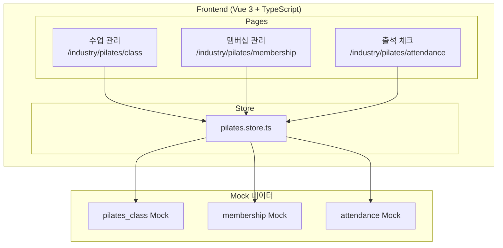
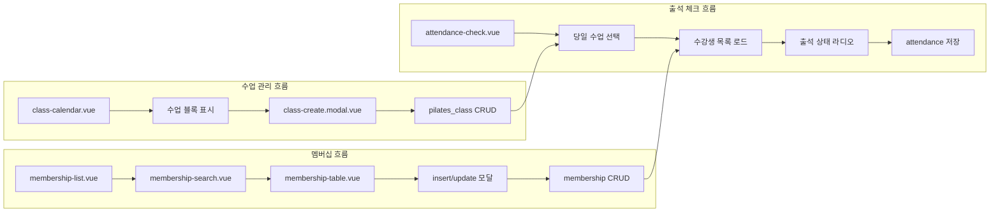
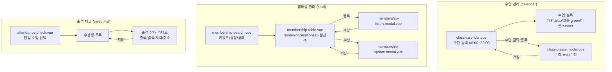
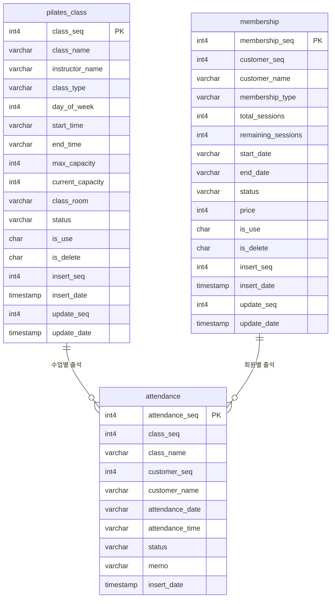

# 필라테스

> 필라테스 수업 관리, 멤버십 관리, 출석 체크

---

# Part A: Visual Overview (사람용)

이 섹션은 시각적 이해를 위한 다이어그램입니다. Mermaid 코드도 텍스트로 읽어 구조 파악에 활용됩니다.

---

## 1. 시스템 아키텍처



---

## 2. 데이터 흐름



---

## 3. UI 흐름도



---

## 4. ER 다이어그램



---

# Part B: Detailed Spec (AI용)

이 섹션은 AI 코드 생성을 위한 상세 명세입니다.

---

## 메타
- 모듈명: industry/pilates
- 테이블명: pilates_class, membership, attendance
- 한글 기능명: 필라테스
- 한줄 설명: 필라테스 수업 관리, 멤버십 관리, 출석 체크
- UI 패턴: calendar (수업) + crud (멤버십) + select-list (출석)
- 파일 업로드: N
- 프로젝트: crm-ui-proto (프론트엔드 프로토타입, Backend 없음, Mock 데이터 사용)
- DB 종류: PostgreSQL (PK: serial4, INT: int4, FK: int4, DATETIME: TIMESTAMP)
- FK 제약조건: 생성하지 않음

---

## 1. 기능 범위 (CRUD)

### pilates_class (수업)
- 목록 조회, 등록, 수정 (달력 기반)
- 페이징: N (달력에 전체 표시)

### membership (멤버십)
| 기능 | 적용 | 설명 |
|------|------|------|
| 페이징 목록 | Y | 키워드/멤버십유형/상태 검색 + 페이지네이션 |
| 상세 조회 | Y | 모달 또는 상세 패널 |
| 등록 | Y | 모달로 등록 |
| 수정 | Y | 모달로 수정 |
| 논리 삭제 | Y | isDelete='Y' 처리 |

### attendance (출석)
- 당일 수업별 출석 체크 (등록/수정)
- select-list 패턴

---

## 2. 타입 정보 (구현 기준)

### PilatesClass
| 필드 | 타입 | 설명 | 선택값 |
|------|------|------|--------|
| classSeq | number | PK | - |
| className | string | 수업명 | - |
| instructorName | string | 강사명 | - |
| classType | string | 수업유형 | 개인/그룹/듀엣 |
| dayOfWeek | number | 요일 | 1~5 (월~금) |
| startTime | string | 시작시간 | - |
| endTime | string | 종료시간 | - |
| maxCapacity | number | 최대 인원 | - |
| currentCapacity | number | 현재 인원 | - |
| classRoom | string | 강의실 | - |
| status | string | 상태 | 활성/비활성 |
| isUse | string | 사용여부 | - |
| isDelete | string | 삭제여부 | - |
| insertSeq | number | 등록자 | - |
| insertDate | string | 등록일 | - |
| updateSeq | number | 수정자 | - |
| updateDate | string | 수정일 | - |

### Membership
| 필드 | 타입 | 설명 | 선택값 |
|------|------|------|--------|
| membershipSeq | number | PK | - |
| customerSeq | number | 고객 PK | - |
| customerName | string | 고객명 | - |
| membershipType | string | 멤버십유형 | 기본/프리미엄/VIP |
| totalSessions | number | 총 횟수 | - |
| remainingSessions | number | 잔여 횟수 | - |
| startDate | string | 시작일 | - |
| endDate | string | 종료일 | - |
| status | string | 상태 | 활성/만료/일시정지 |
| price | number | 가격 | - |
| isUse | string | 사용여부 | - |
| isDelete | string | 삭제여부 | - |
| insertSeq | number | 등록자 | - |
| insertDate | string | 등록일 | - |
| updateSeq | number | 수정자 | - |
| updateDate | string | 수정일 | - |

### Attendance
| 필드 | 타입 | 설명 | 선택값 |
|------|------|------|--------|
| attendanceSeq | number | PK | - |
| classSeq | number | 수업 PK | - |
| className | string | 수업명 | - |
| customerSeq | number | 고객 PK | - |
| customerName | string | 고객명 | - |
| attendanceDate | string | 출석일 | - |
| attendanceTime | string | 출석시간 | - |
| status | string | 출석상태 | 출석/결석/지각/취소 |
| memo | string | 메모 | - |
| insertDate | string | 등록일 | - |

---

## 3. UI 구성

### 3.1 수업 관리 (`/industry/pilates/class`)
- **패턴**: calendar
- **구성**: class-calendar.vue + class-create.modal.vue
- **레이아웃**: 주간 달력 그리드 (월~금, 06:00~22:00)
- **수업 블록**: classType별 색상 (개인:blue, 그룹:green, 듀엣:amber)

### 3.2 멤버십 관리 (`/industry/pilates/membership`)
- **패턴**: crud
- **구성**: membership-list.vue + membership-search.vue + membership-table.vue + insert/update 모달
- **검색**: 키워드, 멤버십유형(membershipType), 상태(status)
- **특이사항**: remainingSessions ≤ 5 → 빨간색 강조

### 3.3 출석 체크 (`/industry/pilates/attendance`)
- **패턴**: select-list
- **구성**: attendance-check.vue
- **동작**: 당일 수업 선택 → 수강생 목록 표시 → 출석 상태 라디오(출석/결석/지각/취소)

---

## 4. Frontend 파일 목록

```
src/modules-domain/industry/pilates/
├── type/pilates.type.ts
├── store/pilates.store.ts
├── pages/
│   ├── _pilates.routes.ts
│   ├── class-calendar.vue
│   ├── class-create.modal.vue
│   ├── membership-list.vue
│   ├── membership-search.vue
│   ├── membership-table.vue
│   ├── membership-insert.modal.vue
│   ├── membership-update.modal.vue
│   └── attendance-check.vue
```

---

## 5. 참조
- 가이드 코드: `src/modules/test-data/`
- UI 생성 스킬: `.claude/skills/gen-ui/SKILL.md`
- AGENTS.md: 필라테스 업종 특화 UI 가이드
