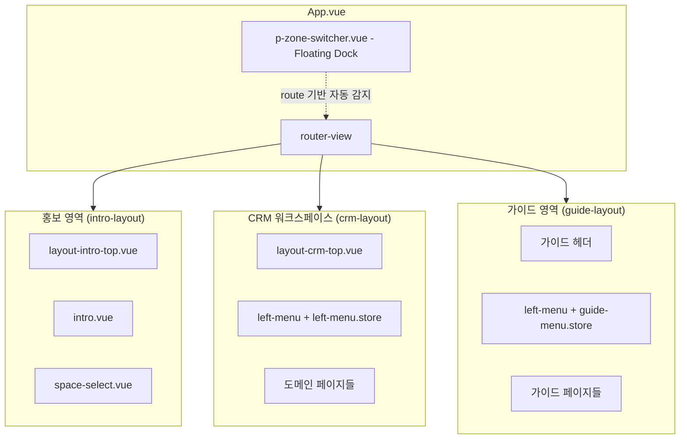
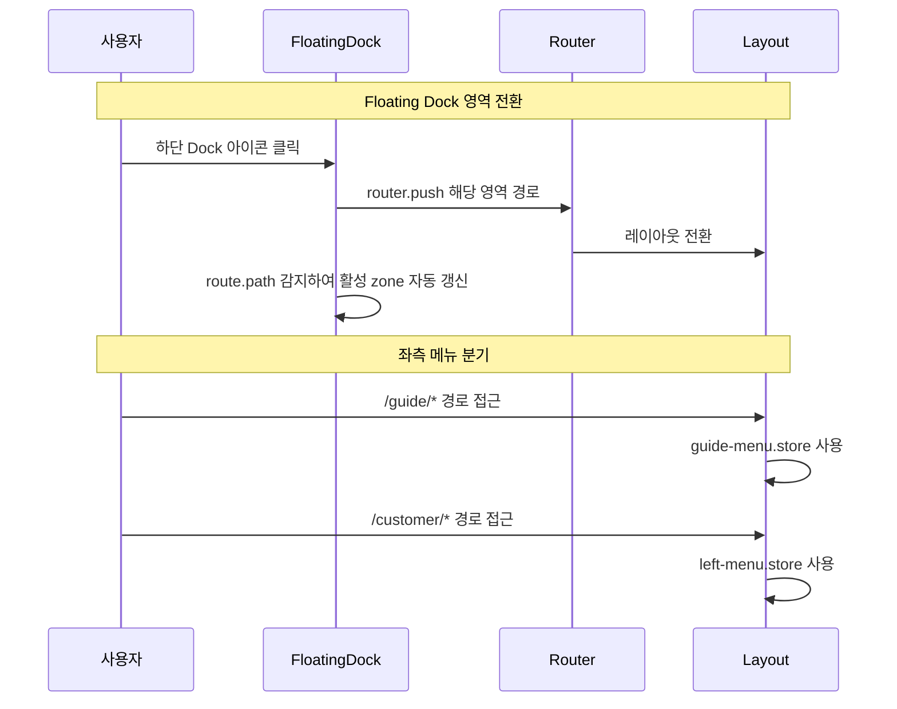
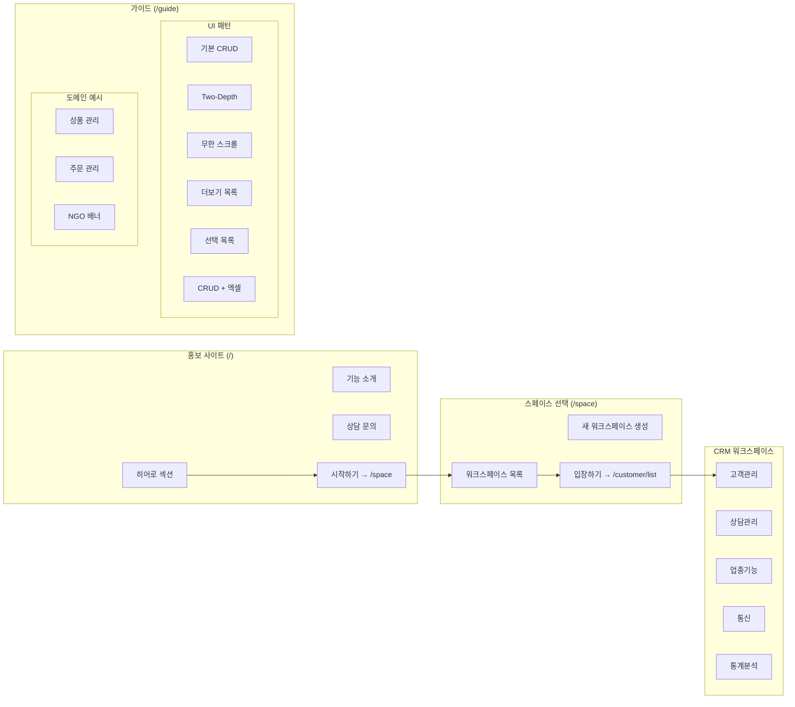
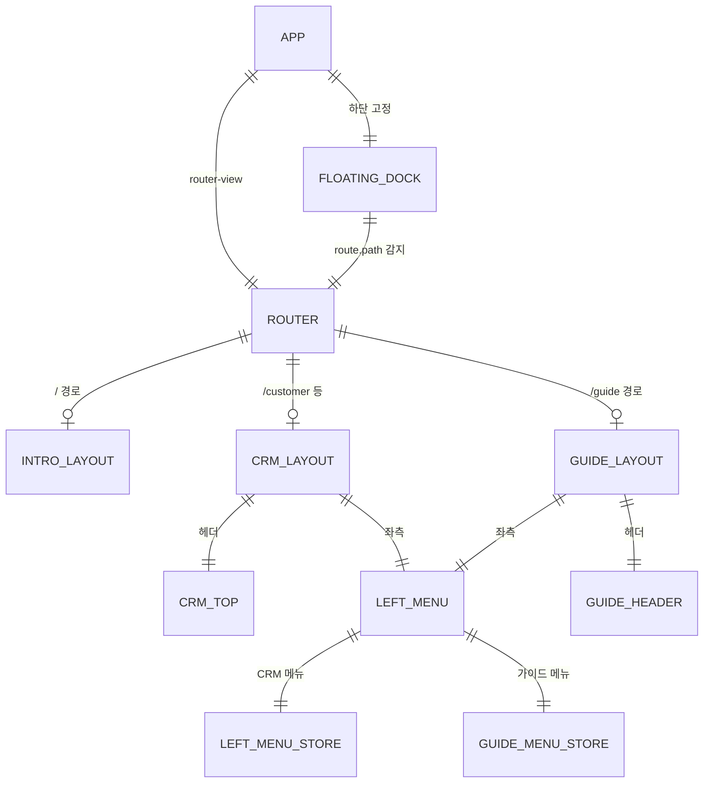

# Zone 네비게이션 시스템

> 3개 영역(홍보 사이트, CRM 워크스페이스, 가이드)을 자유롭게 전환할 수 있는 Zone Switcher 네비게이션 시스템

---

# Part A: Visual Overview (사람용)

이 섹션은 시각적 이해를 위한 다이어그램입니다. Mermaid 코드도 텍스트로 읽어 구조 파악에 활용됩니다.

---

## 시스템 아키텍처



---

## 영역 전환 흐름



---

## UI 흐름도



---

## 컴포넌트 관계도



---

# Part B: Detailed Spec (AI용)

이 섹션은 AI 코드 생성을 위한 상세 명세입니다.

---

## 메타
- 모듈명: zone-navigation (프론트엔드 전용)
- 한글 기능명: Zone 네비게이션 시스템
- 한줄 설명: 3개 영역(홍보, 워크스페이스, 가이드) 간 자유로운 전환을 위한 네비게이션 시스템
- UI 패턴: 커스텀 (레이아웃 + 네비게이션)
- DB: 없음 (프론트엔드 전용)
- 개발자: nettem

---

## 1. 기능 범위

### 핵심 기능
| 기능 | 설명 |
|------|------|
| Zone Switcher | 3개 영역 간 전환 UPopover 컴포넌트 |
| 가이드 레이아웃 | 가이드 전용 레이아웃 (guide-layout.vue) |
| 가이드 메뉴 | 가이드 영역 전용 좌측 메뉴 시스템 |
| 라우트 통합 | /guide 하위로 기존 test, shop, ngo 통합 |
| 레이아웃 정리 | itax-layout → guide-layout 전환, itax-dash-layout 삭제 |

### DB/Backend
- 없음 (프론트엔드 전용 기능)

---

## 2. UI 구성

### Zone Switcher 컴포넌트 (p-zone-switcher.vue) - Floating Dock

| 속성 | 값 |
|------|------|
| props | 없음 (route.path 기반 자동 감지) |
| 위치 | App.vue 내부, 화면 하단 중앙 고정 (fixed bottom) |
| 스타일 | 반투명 pill 형태 독, backdrop-blur, 3개 아이콘 가로 배열 |
| 동작 | 아이콘 클릭 시 해당 영역으로 이동, 활성 zone은 dot 인디케이터 표시 |

Zone 목록:
| Zone | 이름 | 아이콘 | 이동 경로 | 설명 |
|------|------|--------|----------|------|
| intro | 홍보 사이트 | i-lucide-globe | / | 서비스 소개 페이지 |
| workspace | 워크스페이스 | i-lucide-layout-grid | /space | CRM 작업 영역 |
| guide | 가이드 | i-lucide-book-open | /guide/pattern/crud/list | UI 패턴/도메인 예시 |

Floating Dock UI 명세:
| 항목 | 값 |
|------|------|
| 배경 | `bg-white/80 dark:bg-gray-900/80 backdrop-blur-lg` |
| 테두리 | `border border-gray-200/50 dark:border-gray-700/50` |
| 그림자 | `shadow-lg` |
| 둥근 모서리 | `rounded-full` (pill 형태) |
| 위치 | `fixed bottom-6 left-1/2 -translate-x-1/2 z-50` |
| 아이콘 크기 | `w-5 h-5` |
| 활성 상태 | 아이콘 아래 dot (`w-1 h-1 rounded-full bg-primary`) |
| 호버 | 라벨 tooltip 표시 |
| 패딩 | `px-4 py-2` |

### 가이드 레이아웃 (guide-layout.vue)

| 영역 | 컴포넌트 | 설명 |
|------|---------|------|
| 헤더 | 고정 상단 (h-16) | 브랜드 로고 + "가이드" 배지 (Zone Switcher 없음) |
| 좌측 | left-menu | guide-menu.store 메뉴 데이터 사용 |
| 메인 | router-view | 가이드 페이지 표시 |

### 가이드 메뉴 구조

| 섹션 | 메뉴 | 경로 |
|------|------|------|
| UI 패턴 | 기본 CRUD | /guide/pattern/crud/list |
| UI 패턴 | Two-Depth | /guide/pattern/two-depth/list |
| UI 패턴 | 무한 스크롤 | /guide/pattern/infinite-scroll-list/list |
| UI 패턴 | 더보기 목록 | /guide/pattern/show-more-list/list |
| UI 패턴 | 선택 목록 | /guide/pattern/select-list/demo |
| UI 패턴 | CRUD + 엑셀 | /guide/pattern/crud-excel/list |
| 도메인 예시 | 상품 관리 | /guide/domain/product/list |
| 도메인 예시 | 주문 관리 | /guide/domain/order/list |
| 도메인 예시 | NGO 배너 | /guide/domain/ngo-banner/list |

---

## 3. 라우트 구조

### 기존 구조 (제거)
```
/test/*       → itax-layout (test-data 모듈)
/shop/*       → itax-layout (product, order 모듈)
/ngo/*        → itax-layout (ngo-banner 모듈)
```

### 신규 구조
```
/guide                          → guide-layout
├── /guide/pattern              → UI 패턴 가이드
│   ├── crud/list               → 기본 CRUD 목록
│   ├── crud/detail/:testSeq    → 기본 CRUD 상세
│   ├── two-depth/list          → Two-Depth 목록
│   ├── infinite-scroll-list/list → 무한 스크롤
│   ├── show-more-list/list     → 더보기 목록
│   ├── select-list/demo        → 선택 목록 데모
│   └── crud-excel/list         → CRUD + 엑셀
├── /guide/domain               → 도메인 예시
│   ├── product/list            → 상품 관리
│   ├── order/list              → 주문 관리
│   └── ngo-banner/list         → NGO 배너
```

### 호환성 리다이렉트
```
/test/*  → /guide/pattern/*
/shop/*  → /guide/domain/*
/ngo/*   → /guide/domain/ngo-banner/*
```

---

## 4. 파일 목록

### 신규 생성
```
src/modules/layout/
├── guide-layout.vue                    # 가이드 레이아웃
└── components/
    └── p-zone-switcher.vue             # Floating Dock 컴포넌트

src/modules/left-menu/
└── store/
    └── guide-menu.store.ts             # 가이드 전용 메뉴 스토어
```

### 삭제
```
src/modules/layout/itax-layout.vue      # guide-layout.vue로 대체
src/modules/layout/itax-dash-layout.vue # 미사용, 삭제
```

### 수정
```
src/App.vue                                                # Floating Dock 배치
src/router.ts                                              # 라우트 통합
src/modules/left-menu/components/left-menu.vue             # 메뉴 분기
src/modules/layout/components/layout-intro-top.vue         # Zone Switcher 제거 (롤백)
src/modules/layout/components/layout-crm-top.vue           # Zone Switcher 제거 (롤백)
src/modules/layout/guide-layout.vue                        # Zone Switcher 제거
src/modules/layout/components/layout-crm-mobile-menu.vue   # 가이드 링크 유지
```

---

## 5. 참조
- 기존 레이아웃: `src/modules/layout/itax-layout.vue` (guide-layout 기반)
- 메뉴 인터페이스: `src/modules/left-menu/type/left-menu.interface.ts`
- CRM 메뉴 스토어: `src/modules/left-menu/store/left-menu.store.ts`
- 라우터: `src/router.ts`
- 가이드 코드: `src/modules/test-data/`
