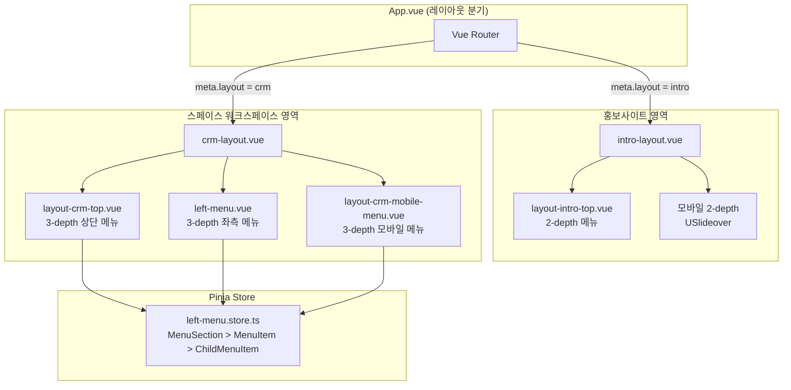
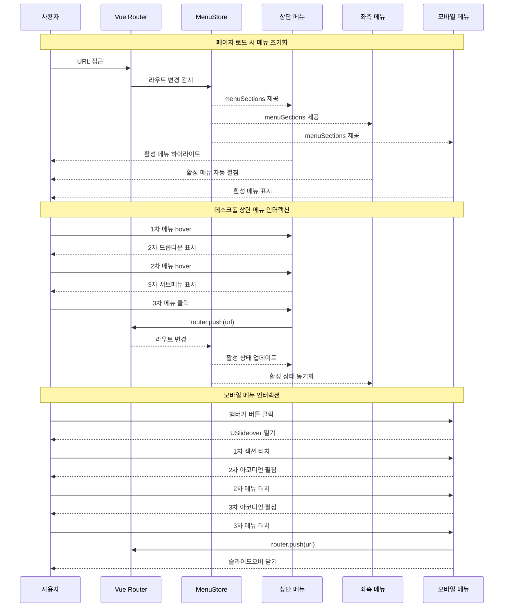
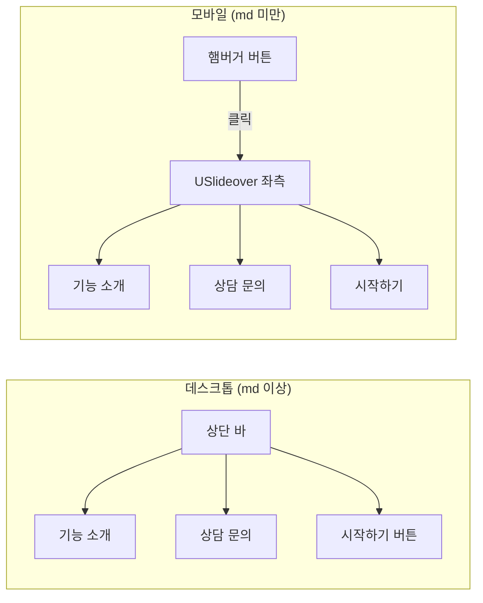
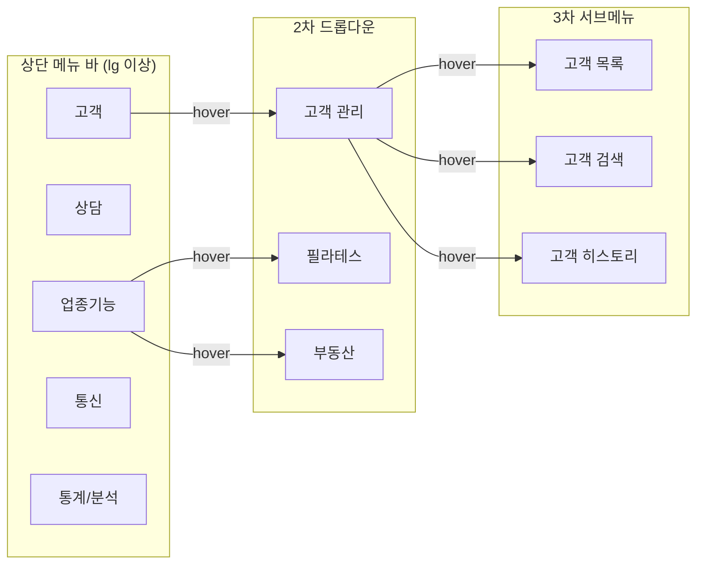
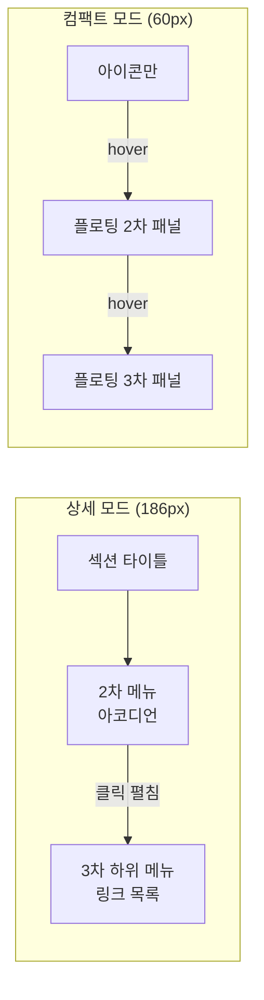
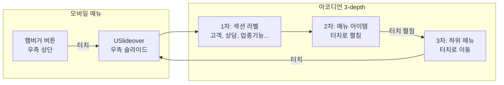
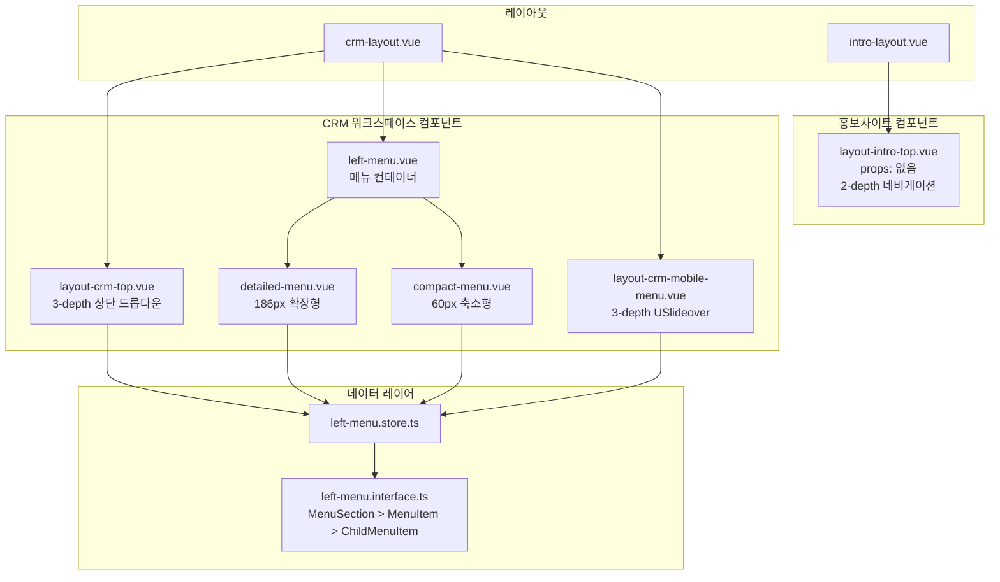

# 프론트-메뉴-시스템

> 피치CRM의 홍보사이트(2-depth)와 스페이스 워크스페이스(3-depth) 메뉴 시스템. 모바일 퍼스트 반응형, 데스크톱 상단/좌측 메뉴 + 모바일 햄버거 메뉴를 지원한다.

---

# Part A: Visual Overview (사람용)

이 섹션은 시각적 이해를 위한 다이어그램입니다. Mermaid 코드도 텍스트로 읽어 구조 파악에 활용됩니다.

---

## 시스템 아키텍처



---

## 메뉴 데이터 흐름



---

## UI 흐름도

### 홍보사이트 메뉴 흐름 (2-depth)



### 스페이스 상단 메뉴 흐름 (3-depth)



### 스페이스 좌측 메뉴 흐름 (3-depth)



### 스페이스 모바일 메뉴 흐름 (3-depth)



---

## 컴포넌트 관계도



---

# Part B: Detailed Spec (AI용)

이 섹션은 AI 코드 생성을 위한 상세 명세입니다.

---

## 메타
- 모듈명: left-menu (기존 모듈 확장)
- 테이블명: 없음 (순수 프론트엔드 모듈)
- 한글 기능명: 프론트-메뉴-시스템
- 한줄 설명: 홍보사이트(2-depth)와 스페이스(3-depth) 통합 메뉴 시스템 - 모바일 퍼스트 반응형
- UI 패턴: 커스텀 (레이아웃 + 네비게이션)
- 파일 업로드: N
- 저장 방식: -
- DB: 없음 (메뉴 데이터는 Store에서 정적 관리)

---

## 1. 기능 범위

### 메뉴 기능

| 기능 | 적용 | 설명 |
|------|------|------|
| 홍보사이트 상단 메뉴 (2-depth) | Y | 데스크톱 네비게이션 바 - 기능 소개, 상담 문의, 시작하기 |
| 홍보사이트 모바일 메뉴 (2-depth) | Y | 햄버거 → USlideover 좌측 - 동일 메뉴 항목 |
| 스페이스 상단 메뉴 (3-depth) | Y | 1차(섹션) → 2차(드롭다운) → 3차(서브메뉴 플로팅) |
| 스페이스 좌측 메뉴 - 상세 모드 (3-depth) | Y | 186px 펼침, 섹션 > 아코디언 > 하위 링크 |
| 스페이스 좌측 메뉴 - 컴팩트 모드 (3-depth) | Y | 60px 접힘, 아이콘 > 플로팅 2차 > 플로팅 3차 |
| 스페이스 모바일 메뉴 (3-depth) | Y | 우측 상단 햄버거 → USlideover → 아코디언 3-depth |
| URL 기반 활성 메뉴 동기화 | Y | 모든 메뉴 영역에서 현재 URL에 맞는 메뉴 활성 표시 |

### 반응형 브레이크포인트

| 브레이크포인트 | 표시 메뉴 | 설명 |
|---------------|----------|------|
| < md (768px) | 모바일 메뉴만 | 햄버거 → USlideover 3-depth |
| md ~ lg (768px ~ 1024px) | 모바일 메뉴 + 상단 메뉴 (2-depth) | 전환 구간 |
| >= lg (1024px) | 상단 메뉴 + 좌측 메뉴 | 데스크톱 풀 메뉴 |

---

## 2. UI 구성

### 2.1 홍보사이트 메뉴 (intro-layout)

#### 데스크톱 (md 이상) - `layout-intro-top.vue`

| 영역 | 컴포넌트 | 설명 |
|------|---------|------|
| 좌측 | 브랜드 로고 | 피치CRM 로고 + 부제 |
| 중앙 | 네비게이션 | 기능 소개(앵커), 상담 문의(앵커) |
| 우측 | CTA 버튼 | 시작하기 → /space 이동 |

#### 모바일 (md 미만) - `layout-intro-top.vue` 내 USlideover

| 영역 | 컴포넌트 | 설명 |
|------|---------|------|
| 헤더 | 로고 + 닫기 | 피치CRM + X 버튼 |
| 메뉴 | 목록 | 기능 소개, 상담 문의 (2-depth) |
| 하단 | CTA | 시작하기 버튼 |

#### 검증
- 2-depth 이하 메뉴만 표시
- 로그인 상태 무관 (홍보용 공개 페이지)

---

### 2.2 스페이스 상단 메뉴 (crm-layout) - 신규

#### 데스크톱 (lg 이상) - `layout-crm-top.vue` 신규 생성

참조: market-www/front `layout-space-top.vue` 패턴

| 영역 | 컴포넌트 | 설명 |
|------|---------|------|
| 좌측 | 브랜드 + 스페이스 정보 | 피치CRM 로고, 스페이스 타입 배지, 스페이스 이름 |
| 중앙 | 3-depth 네비게이션 | 1차 섹션 수평 배치, hover 시 2차 드롭다운, 2차 hover 시 3차 서브메뉴 |
| 우측 | 유틸리티 | 스페이스 전환, 다크모드 토글, Mock 모드 배지 |

**3-depth 드롭다운 인터랙션:**

```
1차 메뉴 (상단 바 수평 배치)
├── [고객] [상담] [업종기능] [통신] [통계/분석]
│
├── hover "고객" → 2차 드롭다운
│   ├── 고객 관리 ← hover → 3차 서브메뉴
│   │                        ├── 고객 목록
│   │                        ├── 고객 검색
│   │                        └── 고객 히스토리
│
├── hover "업종기능" → 2차 드롭다운
│   ├── 필라테스 ← hover → 3차 서브메뉴
│   │                      ├── 수업 관리
│   │                      ├── 멤버십 관리
│   │                      └── 출석 체크
│   └── 부동산 ← hover → 3차 서브메뉴
│                         ├── 매물 관리
│                         └── 매칭 시스템
```

**핵심 구현 패턴 (market-www 참조):**
- `mouseenter` / `mouseleave` 이벤트 기반 드롭다운 제어
- `setTimeout` 150ms 딜레이로 깜빡임 방지
- `activeMenu` ref로 현재 열린 드롭다운 추적
- `activeSection` computed로 URL 기반 현재 섹션 하이라이트
- `isActiveItem(href)` 함수로 개별 메뉴 활성 상태 확인
- 3차 드롭다운: 2차 메뉴 아이템에 `mouseenter` 시 우측에 플로팅 패널 표시

---

### 2.3 스페이스 좌측 메뉴 (crm-layout) - 기존 확장

#### 상세 모드 (186px) - `detailed-menu.vue` 기존

| 영역 | 동작 | 설명 |
|------|------|------|
| 섹션 타이틀 | 표시 | "고객", "상담" 등 1차 그룹 라벨 |
| 2차 메뉴 | 클릭 아코디언 | 아이콘 + 이름, 클릭 시 하위 목록 펼침/접힘 |
| 3차 하위 메뉴 | 링크 | 들여쓰기된 하위 메뉴 목록, 클릭 시 라우트 이동 |

현재 구현 완료 상태. 변경 불필요.

#### 컴팩트 모드 (60px) - `compact-menu.vue` 확장 필요

| 영역 | 동작 | 설명 |
|------|------|------|
| 아이콘 | 표시 | 2차 메뉴 아이콘만 표시 |
| 2차 플로팅 | hover | 아이콘 hover 시 우측 플로팅 패널 (메뉴 이름 + 하위 목록) |
| 3차 플로팅 | hover | 2차 항목에 children이 있는 경우 우측으로 3차 서브 패널 표시 |

**현재 상태:** 2-depth 플로팅까지만 구현. children이 있는 2차 메뉴 hover 시 3차 서브메뉴 플로팅 추가 필요.

**확장 구현:**
```
컴팩트 아이콘 (60px)
│ hover →  [2차 플로팅 패널]
│          ├── 고객 관리 ← hover → [3차 플로팅 패널]
│          │                        ├── 고객 목록
│          │                        ├── 고객 검색
│          │                        └── 고객 히스토리
```

---

### 2.4 스페이스 모바일 메뉴 - 신규

#### `layout-crm-mobile-menu.vue` 신규 생성

참조: market-www/front `layout-space-top.vue`의 모바일 영역

| 영역 | 컴포넌트 | 설명 |
|------|---------|------|
| 트리거 | 햄버거 버튼 | 우측 상단, `lg:hidden`으로 데스크톱에서 숨김 |
| 슬라이드오버 | USlideover | side="right", width 300px |
| 헤더 | 스페이스 정보 | 스페이스 이름 + 타입 + 닫기 버튼 |
| 메뉴 본체 | 아코디언 3-depth | 섹션별 그룹핑, 터치로 펼침/접힘 |
| 하단 | 유틸리티 | 스페이스 전환, 다크모드 토글 |

**3-depth 아코디언 구조:**
```
[슬라이드오버]
├── 헤더 (스페이스 정보 + 닫기)
├── 메뉴 영역
│   ├── ── 고객 ──  (1차: 섹션 타이틀)
│   │   └── 고객 관리  (2차: 터치로 펼침/접힘)
│   │       ├── 고객 목록  (3차: 터치로 이동)
│   │       ├── 고객 검색
│   │       └── 고객 히스토리
│   ├── ── 상담 ──
│   │   └── 상담 관리
│   │       ├── 상담 등록
│   │       ├── 알림톡/SMS
│   │       └── 상담 이력
│   ├── ── 업종기능 ──
│   │   ├── 필라테스
│   │   │   ├── 수업 관리
│   │   │   ├── 멤버십 관리
│   │   │   └── 출석 체크
│   │   └── 부동산
│   │       ├── 매물 관리
│   │       └── 매칭 시스템
│   ├── ── 통신 ──
│   │   └── 전화
│   │       ├── 통화 이력
│   │       └── 녹취 청취
│   └── ── 통계/분석 ──
│       ├── KPI 모니터링  (단일 링크, children 없음)
│       └── AI 리포트  (단일 링크, children 없음)
├── 유틸리티
│   ├── 스페이스 전환
│   └── 다크모드 토글
```

**핵심 인터랙션:**
- 메뉴 클릭 시 `router.push(url)` 후 슬라이드오버 자동 닫기
- 현재 URL에 해당하는 메뉴 자동 펼침 + 활성 표시
- children이 없는 메뉴(KPI 모니터링, AI 리포트)는 바로 링크로 동작

---

### 2.5 crm-layout.vue 반응형 개선

#### 현재 상태
- `min-w-[1200px]` 고정 → 데스크톱 전용
- 좌측 메뉴만 사용, 상단 메뉴 없음, 모바일 지원 없음

#### 목표 상태

| 화면 크기 | 상단 메뉴 | 좌측 메뉴 | 모바일 메뉴 |
|----------|----------|----------|------------|
| < lg (1024px) | 숨김 | 숨김 | 표시 (햄버거) |
| >= lg (1024px) | 표시 (3-depth) | 표시 (토글) | 숨김 |

**레이아웃 변경 핵심:**
- `min-w-[1200px]` 제거 → 반응형 컨테이너
- 상단 헤더에 `layout-crm-top.vue` 추가
- 모바일 영역에 `layout-crm-mobile-menu.vue` 추가
- 좌측 메뉴: `hidden lg:block`으로 데스크톱에서만 표시
- 메인 콘텐츠: 좌측 메뉴 유무에 따라 `ps-[186px]` / `ps-[60px]` / `ps-0` 반응형 전환

---

### 2.6 URL 기반 활성 메뉴 동기화

모든 메뉴 영역에서 동일한 로직 적용:

| 항목 | 로직 | 설명 |
|------|------|------|
| 섹션 활성 | `route.path`가 섹션 내 메뉴 URL과 매칭 | 상단 메뉴 1차 하이라이트 |
| 메뉴 활성 | `route.path === menu.url` 또는 `startsWith` | 정확한 URL 매칭 |
| 자동 펼침 | 활성 메뉴의 부모 아코디언 자동 열기 | 좌측 메뉴, 모바일 메뉴 |
| 서브페이지 | 모달로 처리하여 URL 변경 최소화 | 메뉴 활성 상태 유지 |

**구현 패턴 (market-www 참조):**
```typescript
// 현재 경로에 해당하는 섹션 찾기
const activeSection = computed(() => {
  const path = route.path;
  for (const section of menuSections) {
    for (const menu of section.menus) {
      if (menu.url && path.startsWith(menu.url)) return section.id;
      if (menu.children?.some(child => path.startsWith(child.url))) return section.id;
    }
  }
  return null;
});

// 개별 메뉴 활성 확인
const isActiveItem = (url: string): boolean => {
  if (!url) return false;
  return route.path === url || route.path.startsWith(url + '/');
};
```

---

## 3. 타입 정의

### 기존 인터페이스 (변경 불필요)

`src/modules/left-menu/type/left-menu.interface.ts` - 현재 3-depth 구조가 이미 정의되어 있음:

```typescript
/** 섹션 (최상위 그룹) - 1차 depth */
export interface MenuSection {
  id: number;
  sectionTitle: string; // 섹션 타이틀 (예: "고객", "상담")
  menus: MenuItem[];    // 2차 메뉴 목록
}

/** 메뉴 아이템 (2차 depth) */
export interface MenuItem {
  id: number;
  name: string;
  url: string;           // 비어있으면 아코디언 (자식 있음)
  icon: string;          // tabler icon 이름
  hideInProd: boolean;
  children?: ChildMenuItem[]; // 3차 하위 메뉴
}

/** 하위 메뉴 아이템 (3차 depth) */
export interface ChildMenuItem {
  id: number;
  name: string;
  url: string;
  hideInProd: boolean;
}

/** 좌측 메뉴 상태 */
export interface LeftMenuState {
  menuSections: MenuSection[];
}
```

### 추가 필요 타입

```typescript
/** 상단 메뉴 활성 상태 */
export interface TopMenuState {
  activeMenu: string | null;       // 현재 열린 드롭다운 ID
  activeSubmenu: number | null;    // 현재 열린 3차 서브메뉴의 2차 메뉴 ID
}

/** 모바일 메뉴 상태 */
export interface MobileMenuState {
  isOpen: boolean;                // 슬라이드오버 열림 상태
  expandedSections: number[];     // 펼쳐진 2차 메뉴 ID 배열
}
```

---

## 4. 메뉴 데이터 구조

### 현재 Store 데이터 (left-menu.store.ts)

현재 5개 섹션의 메뉴 데이터가 정의되어 있으며, 상단 메뉴/좌측 메뉴/모바일 메뉴에서 동일하게 사용:

| 섹션 (1차) | 메뉴 (2차) | 하위 메뉴 (3차) |
|-----------|-----------|----------------|
| 고객 | 고객 관리 | 고객 목록, 고객 검색, 고객 히스토리 |
| 상담 | 상담 관리 | 상담 등록, 알림톡/SMS, 상담 이력 |
| 업종기능 | 필라테스 | 수업 관리, 멤버십 관리, 출석 체크 |
| 업종기능 | 부동산 | 매물 관리, 매칭 시스템 |
| 통신 | 전화 | 통화 이력, 녹취 청취 |
| 통계/분석 | KPI 모니터링 | (단일 링크) |
| 통계/분석 | AI 리포트 | (단일 링크) |

---

## 5. 파일 목록

### 신규 생성 파일

```
src/modules/layout/components/
├── layout-crm-top.vue              # CRM 상단 3-depth 드롭다운 메뉴 (데스크톱)
└── layout-crm-mobile-menu.vue      # CRM 모바일 3-depth 아코디언 메뉴 (USlideover)
```

### 수정 필요 파일

```
src/modules/layout/
├── crm-layout.vue                  # 반응형 레이아웃 개선 (min-w 제거, 상단/모바일 메뉴 추가)
├── intro-layout.vue                # 2-depth 메뉴 완성 확인
└── components/
    └── layout-intro-top.vue        # 2-depth 메뉴 보완 (공지사항, Q&A 등 추가 가능)

src/modules/left-menu/
├── type/
│   └── left-menu.interface.ts      # TopMenuState, MobileMenuState 타입 추가
├── store/
│   └── left-menu.store.ts          # getter 확장 (activeSection, isActiveItem 등)
└── components/
    └── compact-menu.vue            # 3-depth 플로팅 서브메뉴 추가
```

### 파일별 변경 상세

| 파일 | 변경 유형 | 핵심 변경 내용 |
|------|---------|--------------|
| `crm-layout.vue` | 수정 | `min-w-[1200px]` 제거, `layout-crm-top` + `layout-crm-mobile-menu` 추가, 반응형 클래스 |
| `layout-crm-top.vue` | 신규 | market-www `layout-space-top.vue` 참조, 3-depth 드롭다운 메뉴, mouseenter/mouseleave |
| `layout-crm-mobile-menu.vue` | 신규 | USlideover + 아코디언 3-depth, 햄버거 버튼, 현재 URL 활성 표시 |
| `compact-menu.vue` | 수정 | 2차 메뉴 hover 시 children이 있으면 3차 플로팅 패널 추가 |
| `left-menu.interface.ts` | 수정 | `TopMenuState`, `MobileMenuState` 인터페이스 추가 |
| `left-menu.store.ts` | 수정 | `activeSection`, `isActiveItem` getter 추가 |
| `layout-intro-top.vue` | 확인 | 2-depth 메뉴 동작 확인, 필요 시 보완 |

---

## 6. 참조

### 참조 프로젝트 (market-www/front)
- 상단 메뉴: `src/modules/layout/components/layout-space-top.vue`
  - 2-depth 드롭다운 + mouseenter/mouseleave 패턴
  - 모바일 USlideover 슬라이드오버 패턴
  - `activeMenu`, `activeSection`, `isActiveItem` 상태 관리 패턴
- 홍보사이트 상단 메뉴: `src/modules/layout/components/layout-top.vue`
  - 2-depth 네비게이션 + 모바일 슬라이드오버

### 현재 프로젝트 가이드 코드
- 좌측 메뉴: `src/modules/left-menu/` (타입, 스토어, 컴포넌트 패턴)
- 레이아웃: `src/modules/layout/` (crm-layout, intro-layout 패턴)

### 디자인 원칙
- Primary 컬러: `#287dff`
- 다크모드: `dark:bg-[#141414]` 계열
- 그림자: `shadow-sm` 최대
- 둥근 모서리: `rounded-lg` 최대
- AI Slop 금지: 그라데이션, 과도한 그림자, 과잉 애니메이션 사용 금지
