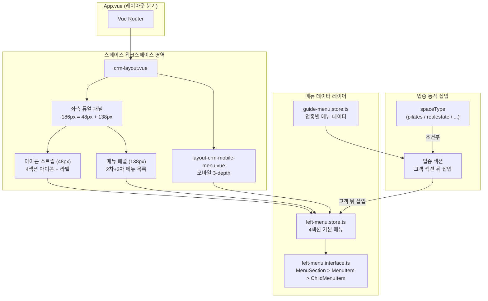
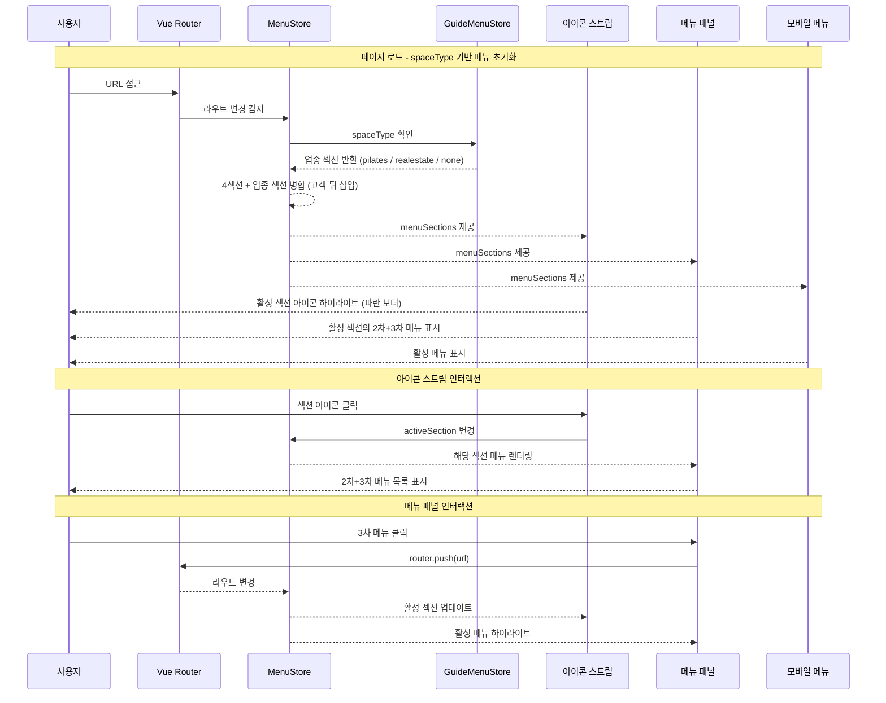
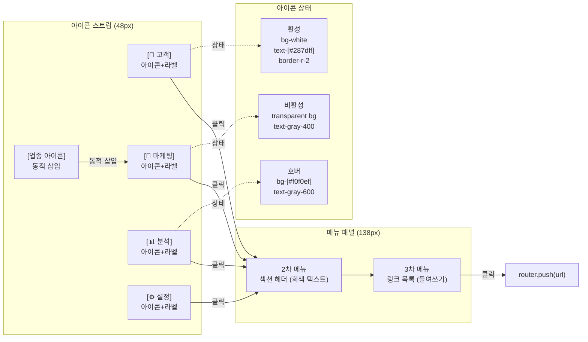

# 메뉴-체계-재정립

> 피치CRM 3뎁스 메뉴 체계 재정립 + 좌측 사이드바 듀얼 패널 방식 전환. 단일 코드베이스 + 업종별 테이블 확장 아키텍처(전략 A) 기반, 대메뉴 4섹션 + 업종 동적 삽입 구조.

---

# Part A: Visual Overview (사람용)

이 섹션은 시각적 이해를 위한 다이어그램입니다. Mermaid 코드도 텍스트로 읽어 구조 파악에 활용됩니다.

---

## 시스템 아키텍처



---

## 메뉴 데이터 흐름



---

## 듀얼 패널 UI 흐름



---

## 듀얼 패널 구조도

```
|<----------- 186px ------------>|
|  48px   |      138px           |
| Icon    |   Menu Panel         |
| Strip   |                      |
|---------|                      |
| [👤고객]| ┌─ 섹션: 고객 ──────┐|
| [ 마케팅]| │ ● 고객 관리       │|
| [ 분석] | │   고객 목록       │|
| [ 설정] | │   고객 검색       │|
|         | │   고객 히스토리   │|
|         | │   고객 등록       │|
|         | │ ● 상담 관리       │|
|         | │   상담 등록       │|
|         | │   상담 이력       │|
|         | └──────────────────┘|

아이콘 스트립 상태:
 활성:  [bg-white] [text-#287dff] [border-r-2 border-#287dff]
 호버:  [bg-#f0f0ef] [text-gray-600]
 비활성: [transparent] [text-gray-400]
```

---

# Part B: Detailed Spec (AI용)

이 섹션은 AI 코드 생성을 위한 상세 명세입니다.

---

## 메타

- 날짜: 2026-02-18
- 작성자: nettem
- 상태: active
- 브랜치: feature/menu-restructure
- 모듈명: left-menu (기존 모듈 전면 개편)
- 테이블명: 없음 (순수 프론트엔드 모듈)
- 한글 기능명: 메뉴-체계-재정립
- 한줄 설명: 피치CRM 4섹션 + 업종 동적 삽입 구조, 좌측 사이드바 듀얼 패널(48px 아이콘 스트립 + 138px 메뉴 패널) 방식으로 전환
- UI 패턴: 커스텀 (듀얼 패널 레이아웃)
- 파일 업로드: N
- 저장 방식: -
- DB: 없음 (메뉴 데이터는 Store에서 정적 관리)
- 아키텍처: 전략 A (단일 코드베이스 + 업종별 테이블 확장) - 박동재 팀장, 박성재 책임 합의

---

## 1. 기능 범위

### 핵심 변경 사항

| 항목 | 변경 전 | 변경 후 |
|------|---------|---------|
| 섹션 구성 | 고객/상담/업종기능/통신/통계분석 (5섹션) | 고객/마케팅/분석/설정 (4섹션) + 업종 동적 삽입 |
| 좌측 메뉴 구조 | 단일 패널 (186px) | 듀얼 패널 (48px 아이콘 스트립 + 138px 메뉴 패널) |
| 아이콘 스트립 배경 | 검정 배경 (인지 불가) | bg-gray-50 계열 + 파란 보더 인디케이터 |
| 업종 메뉴 위치 | 별도 섹션 (업종기능) | 고객 섹션 뒤 동적 삽입 |
| 섹션 아이콘 | MenuItem.icon 사용 | MenuSection.icon 직접 참조 |

### 기능 목록

| 기능 | 적용 | 설명 |
|------|------|------|
| 4섹션 기본 메뉴 구성 | Y | 고객, 마케팅, 분석, 설정 |
| 업종 섹션 동적 삽입 | Y | spaceType 기반 고객 섹션 뒤 삽입 |
| 듀얼 패널 좌측 메뉴 | Y | 48px 아이콘 스트립 + 138px 메뉴 패널 |
| 아이콘 스트립 활성 인디케이터 | Y | 파란 우측 보더 (border-r-2 border-[#287dff]) |
| 모바일 메뉴 섹션 아이콘 참조 | Y | getSectionIcon 제거 → section.icon 직접 참조 |
| URL 기반 활성 메뉴 동기화 | Y | 모든 패널에서 현재 URL 기반 활성 표시 |

---

## 2. 4섹션 메뉴 구조

### 섹션 1: 고객 (icon: IconUsers)

| 2차 메뉴 | 3차 하위 메뉴 |
|---------|-------------|
| 고객 관리 | 고객 목록, 고객 검색, 고객 히스토리, 고객 등록, 고객 태그 관리 |
| 상담 관리 | 상담 등록, 상담 이력, 알림톡/SMS, 예약 관리, 상담 템플릿 |
| 고객 연락처 | 전화 이력, 녹취 청취, 문자 발송, 이메일 발송 |
| 고객 그룹 | 그룹 목록, 그룹 등록, 세그먼트 |
| 즐겨찾기 | 즐겨찾기 목록, 최근 방문 고객 |
| 고객 설정 | 필드 관리, 태그 관리 |

### 섹션 2: 마케팅 (icon: IconSpeakerphone)

| 2차 메뉴 | 3차 하위 메뉴 |
|---------|-------------|
| 알림톡 | 알림톡 발송, 발송 이력, 템플릿 관리, 수신 거부 관리 |
| SMS/LMS | SMS 발송, LMS 발송, 발송 이력 |
| 이메일 | 이메일 발송, 발송 이력, 템플릿 관리 |
| 캠페인 | 캠페인 목록, 캠페인 등록, 캠페인 결과 |
| 자동화 | 자동화 규칙, 트리거 설정 |
| 마케팅 설정 | 수신 거부, 발송 한도 |

### 섹션 3: 분석 (icon: IconChartBar)

| 2차 메뉴 | 3차 하위 메뉴 |
|---------|-------------|
| KPI 모니터링 | 대시보드, KPI 설정, 목표 관리 |
| AI 리포트 | AI 분석, 예측 리포트, 인사이트 |
| 통계 | 고객 통계, 상담 통계, 마케팅 통계 |
| 통화 분석 | 통화 통계, 녹취 분석 |
| 성과 분석 | 담당자별 성과, 팀 성과 |
| 리포트 | 리포트 목록, 리포트 생성 |

### 섹션 4: 설정 (icon: IconSettings)

| 2차 메뉴 | 3차 하위 메뉴 |
|---------|-------------|
| 스페이스 | 스페이스 정보, 업종 설정, 플랜 관리 |
| 사용자 | 사용자 목록, 권한 설정, 초대 관리 |
| 연동 | API 키 관리, 외부 서비스 연동 |
| 알림 | 알림 설정, 알림 이력 |
| 커스터마이징 | 대시보드 설정, 메뉴 설정 |
| 보안 | 접근 로그, 2FA 설정 |

---

## 3. 업종 섹션 (고객 섹션 뒤 동적 삽입)

spaceType 값에 따라 고객 섹션(index 0) 바로 뒤에 삽입.

### 필라테스 (icon: IconStretching)

| 2차 메뉴 | 3차 하위 메뉴 |
|---------|-------------|
| 수업 관리 | 수업 목록, 수업 스케줄, 강사 관리, 수업 예약 |
| 멤버십 | 멤버십 목록, 멤버십 등록, 만료 관리 |
| 출석 | 출석 체크, 출석 이력, 통계 |
| 회원권 | 회원권 목록, 회원권 설정 |
| 락커 | 락커 현황, 락커 배정 |
| 정산 | 수입 현황, 환불 관리 |

### 부동산 (icon: IconBuilding)

| 2차 메뉴 | 3차 하위 메뉴 |
|---------|-------------|
| 매물 | 매물 목록, 매물 등록, 매물 수정 |
| 매칭 | 고객-매물 매칭, 매칭 이력 |
| 계약 | 계약 목록, 계약 등록 |
| 임대 | 임대 현황, 임대 계약 |
| 공인중개사 | 중개사 목록, 수수료 관리 |
| 부동산 분석 | 시세 분석, 거래 통계 |

### 삽입 로직

```typescript
// guide-menu.store.ts 또는 left-menu.store.ts 내부
const buildMenuSections = (spaceType: string): MenuSection[] => {
  const base = [...baseSections]; // 고객, 마케팅, 분석, 설정
  const industrySection = getIndustrySection(spaceType); // pilates / realestate / null
  if (industrySection) {
    // 고객 섹션(index 0) 바로 뒤에 삽입
    base.splice(1, 0, industrySection);
  }
  return base;
};
```

---

## 4. 듀얼 패널 디자인 스펙

### 전체 구조

```
좌측 사이드바 총 너비: 186px
├── 아이콘 스트립: 48px (fixed)
└── 메뉴 패널: 138px (나머지)
```

### 4.1 아이콘 스트립 (48px)

각 섹션 아이콘 버튼의 3가지 상태:

| 상태 | 배경 | 아이콘 색 | 라벨 색 | 보더 |
|------|------|---------|--------|------|
| 비활성 | transparent | text-gray-400 | text-gray-400 text-[9px] | 없음 |
| 호버 | bg-[#f0f0ef] | text-gray-600 | text-gray-600 | 없음 |
| 활성 | bg-white dark:bg-[#252525] | text-[#287dff] | text-[#287dff] font-medium | border-r-2 border-[#287dff] |

**배경 원칙**: 검정 배경 사용 금지. 밝은 배경(bg-gray-50 계열)으로 아이콘 인지성 확보.

**아이콘 버튼 구조:**
```html
<button
  class="flex flex-col items-center justify-center w-12 h-12 gap-0.5 relative"
  :class="isActive ? 'bg-white dark:bg-[#252525]' : 'hover:bg-[#f0f0ef]'"
>
  <!-- 활성 시 우측 파란 보더 인디케이터 -->
  <div v-if="isActive" class="absolute right-0 top-1 bottom-1 w-0.5 bg-[#287dff] rounded-l" />
  <component :is="section.icon" class="w-4 h-4" :class="isActive ? 'text-[#287dff]' : 'text-gray-400'" />
  <span class="text-[9px]" :class="isActive ? 'text-[#287dff] font-medium' : 'text-gray-400'">
    {{ section.sectionTitle }}
  </span>
</button>
```

### 4.2 메뉴 패널 (138px)

| 속성 | 값 |
|------|-----|
| 배경 | bg-[#fbfbfa] dark:bg-[#1a1a1a] |
| 2차 메뉴 (섹션 헤더 역할) | text-[11px] font-semibold text-[#91918e] uppercase tracking-wide, 구분선 역할 |
| 3차 메뉴 (링크) | pl-3 pr-2 py-1 text-[12px] |
| 3차 메뉴 활성 상태 | text-[#287dff] bg-[#f0f0ef] rounded |
| 3차 메뉴 비활성 상태 | text-gray-600 dark:text-gray-400 |

---

## 5. 타입 변경

### left-menu.interface.ts 수정

`MenuSection`에 `icon` 필드 추가:

```typescript
/** 섹션 (최상위 그룹) - 1차 depth */
export interface MenuSection {
  id: number;
  sectionTitle: string; // 섹션 타이틀 (예: "고객", "마케팅")
  icon: string;         // 섹션 아이콘 (예: "IconUsers") - 신규 추가
  menus: MenuItem[];    // 2차 메뉴 목록
}

/** 메뉴 아이템 (2차 depth) */
export interface MenuItem {
  id: number;
  name: string;
  url: string;           // 비어있으면 섹션 헤더 역할
  icon: string;          // tabler icon 이름 (컴팩트 모드용)
  hideInProd: boolean;
  children: ChildMenuItem[]; // 3차 하위 메뉴
}

/** 하위 메뉴 아이템 (3차 depth) */
export interface ChildMenuItem {
  id: number;
  name: string;
  url: string;
  hideInProd: boolean;
}

/** 좌측 메뉴 상태 */
export interface LeftMenuState {
  menuSections: MenuSection[];
  activeSectionId: number; // 현재 활성 섹션 ID
}
```

---

## 6. 컴포넌트 변경 상세

### 6.1 detailed-menu.vue - Notion 스타일 → 듀얼 패널 전면 리팩토링

기존 단일 패널(186px) 구조를 듀얼 패널(48px + 138px)로 전면 교체.

**핵심 구현:**
```vue
<template>
  <div class="flex h-full" style="width: 186px">
    <!-- 아이콘 스트립 (48px) -->
    <div class="w-12 flex flex-col items-center py-2 gap-1 bg-[#f7f7f6] dark:bg-[#1e1e1e] border-r border-gray-200 dark:border-gray-800">
      <button
        v-for="section in menuSections"
        :key="section.id"
        class="relative flex flex-col items-center justify-center w-12 h-12 gap-0.5"
        :class="activeSectionId === section.id ? 'bg-white dark:bg-[#252525]' : 'hover:bg-[#f0f0ef] dark:hover:bg-[#2a2a2a]'"
        @click="activeSectionId = section.id"
      >
        <div v-if="activeSectionId === section.id" class="absolute right-0 top-1 bottom-1 w-0.5 bg-[#287dff] rounded-l" />
        <component :is="section.icon" class="w-4 h-4" :class="activeSectionId === section.id ? 'text-[#287dff]' : 'text-gray-400'" />
        <span class="text-[9px]" :class="activeSectionId === section.id ? 'text-[#287dff] font-medium' : 'text-gray-400'">
          {{ section.sectionTitle }}
        </span>
      </button>
    </div>

    <!-- 메뉴 패널 (138px) -->
    <div class="flex-1 overflow-y-auto py-2 bg-[#fbfbfa] dark:bg-[#1a1a1a]">
      <template v-for="menu in activeSection?.menus" :key="menu.id">
        <!-- 2차 메뉴: 섹션 헤더 역할 -->
        <div class="px-3 pt-3 pb-1 text-[11px] font-semibold text-[#91918e] uppercase tracking-wide">
          {{ menu.name }}
        </div>
        <!-- 3차 메뉴: 링크 목록 -->
        <RouterLink
          v-for="child in menu.children"
          :key="child.id"
          :to="child.url"
          class="flex items-center pl-3 pr-2 py-1 text-[12px] rounded mx-1"
          :class="isActive(child.url) ? 'text-[#287dff] bg-[#f0f0ef]' : 'text-gray-600 dark:text-gray-400 hover:bg-[#f0f0ef]'"
        >
          {{ child.name }}
        </RouterLink>
      </template>
    </div>
  </div>
</template>
```

### 6.2 compact-menu.vue - 2차 메뉴 아이콘 → 섹션 아이콘 변경

컴팩트 모드(60px)에서 2차 메뉴 아이콘 대신 섹션 아이콘 표시.

**변경 전:**
```vue
<!-- MenuItem.icon 사용 -->
<component :is="menu.icon" class="w-5 h-5" />
```

**변경 후:**
```vue
<!-- MenuSection.icon 사용 -->
<component :is="section.icon" class="w-5 h-5" />
```

### 6.3 layout-crm-mobile-menu.vue - getSectionIcon 제거

`getSectionIcon` 헬퍼 함수 제거, `section.icon` 직접 참조.

**변경 전:**
```typescript
const getSectionIcon = (sectionTitle: string): string => {
  const iconMap: Record<string, string> = { '고객': 'IconUsers', ... };
  return iconMap[sectionTitle] ?? 'IconMenu';
};
```

**변경 후:**
```vue
<!-- section.icon 직접 참조 -->
<component :is="section.icon" class="w-5 h-5" />
```

---

## 7. 파일 목록

### 수정 파일

| 파일 | 변경 유형 | 핵심 변경 내용 |
|------|---------|--------------|
| `src/modules/left-menu/type/left-menu.interface.ts` | 수정 | `MenuSection.icon: string` 필드 추가, `activeSectionId` 상태 추가 |
| `src/modules/left-menu/store/left-menu.store.ts` | 수정 | 4섹션 데이터 재구성, 각 섹션에 icon 추가, buildMenuSections() 추가 |
| `src/modules/left-menu/store/guide-menu.store.ts` | 수정 | 업종별 섹션 데이터 재구성, icon 필드 포함 |
| `src/modules/left-menu/components/detailed-menu.vue` | 전면 리팩토링 | 단일 패널 → 듀얼 패널 (48px 아이콘 스트립 + 138px 메뉴 패널) |
| `src/modules/left-menu/components/compact-menu.vue` | 수정 | MenuItem.icon → MenuSection.icon 참조 변경 |
| `src/modules/layout/components/layout-crm-mobile-menu.vue` | 수정 | getSectionIcon 헬퍼 제거 → section.icon 직접 참조 |

---

## 8. 검증 명령어

```bash
cd /Users/nettem/source/peachCRM/crm-ui-proto
bun run dev
npx vue-tsc --noEmit
bun run lint:fix
bun run build
```

---

## 9. 참조

### 디자인 원칙
- Primary 컬러: `#287dff`
- 아이콘 스트립 배경: `#f7f7f6` (밝은 계열, 검정 금지)
- 활성 인디케이터: `border-r-2 border-[#287dff]` (우측 파란 보더)
- 메뉴 패널 배경: `#fbfbfa`
- 다크모드: `dark:bg-[#1a1a1a]` / `dark:bg-[#252525]` 계열
- AI Slop 금지: 그라데이션, 과도한 그림자, 과잉 애니메이션 사용 금지

### 가이드 코드
- Frontend: `front/src/modules/test-data/`
- 좌측 메뉴: `src/modules/left-menu/` (타입, 스토어, 컴포넌트 패턴)
